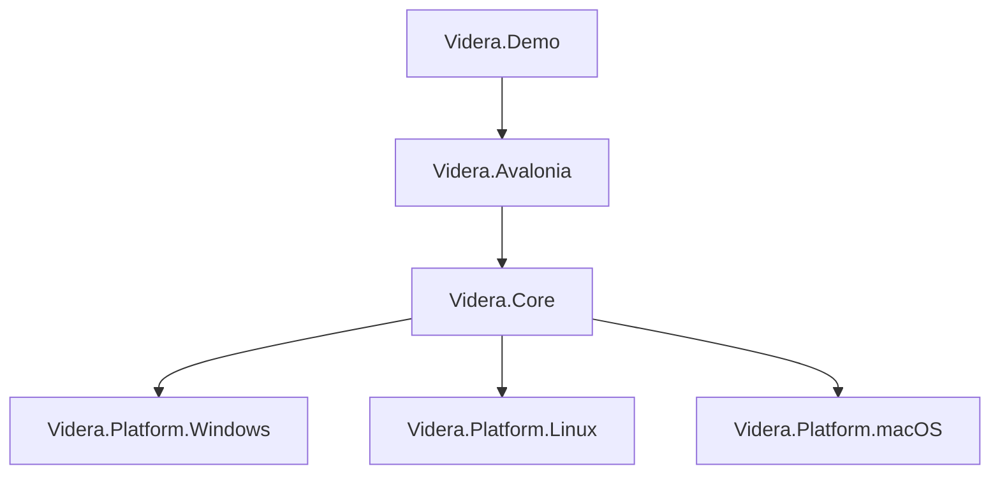
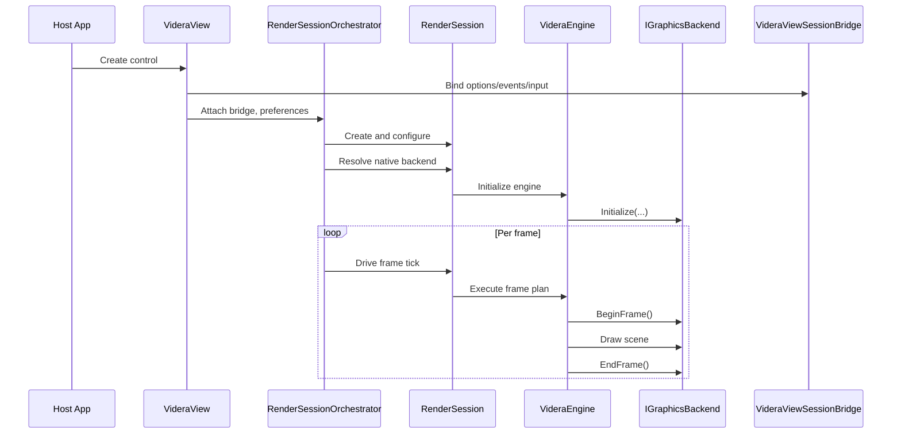

# Videra Architecture

[English](ARCHITECTURE.md) | [中文](docs/zh-CN/ARCHITECTURE.md)

This document describes Videra's public architecture boundaries, module responsibilities, and runtime flow for contributors and evaluators.

## Design Goals

Videra is designed to provide stable 3D viewer capabilities inside Avalonia desktop applications:

- Unify cross-platform 3D view behavior
- Keep core rendering logic decoupled from platform graphics APIs
- Select the most suitable native backend per platform
- Provide a software fallback for diagnostics and no-GPU environments
- Maintain clear boundaries between demo code, library code, and validation

## Layering



### `Videra.Core`

Platform-agnostic rendering layer responsible for:

- Rendering abstractions
- Scene object and engine lifecycle
- Camera, grid, axis, and wireframe logic
- Model import
- Render-style presets
- Software fallback rendering
- Frame-plan construction and pipeline execution via `VideraEngine`

Key abstractions:

- `IGraphicsBackend`
- `IResourceFactory`
- `ICommandExecutor`
- `GraphicsBackendFactory`

### `Videra.Avalonia`

UI integration layer responsible for:

- Hosting the `VideraView` UI shell
- Host-agnostic orchestration through `RenderSessionOrchestrator`
- Coordinating render-session lifecycle and backend selection
- Hosting Avalonia-specific runtime/presentation adapters in `RenderSession`
- Translating view-level input/options/events through `VideraViewSessionBridge`

This layer lets host apps use the 3D view from XAML or code without coupling UI surface code to rendering internals.

### Native Backend Packages

Each backend implements `IGraphicsBackend` against a native graphics API:

- `Videra.Platform.Windows`: Direct3D 11
- `Videra.Platform.Linux`: Vulkan
- `Videra.Platform.macOS`: Metal

These packages handle:

- Device initialization
- Swapchain / drawable lifecycle
- Depth-buffer and frame management
- Resource factories and command executors

### `Videra.Demo`

The demo application shows:

- `VideraView` integration
- Model import flows
- Render-style and wireframe switching
- Grid, axes, and basic object transforms
- Backend status and default scene bootstrapping

## Repository Layout

```text
Videra/
├── src/
│   ├── Videra.Core/
│   ├── Videra.Avalonia/
│   ├── Videra.Platform.Windows/
│   ├── Videra.Platform.Linux/
│   └── Videra.Platform.macOS/
├── samples/
│   └── Videra.Demo/
├── tests/
├── docs/
├── verify.sh
└── verify.ps1
```

## Runtime Flow



## Render Pipeline Contract

Phase 10 makes the orchestration boundary explicit without changing the public rendering model. `VideraEngine` owns frame-plan construction and pipeline execution in Core; orchestration of *when* frames are run moves through `RenderSessionOrchestrator` / `RenderSession`.

Stable stage vocabulary for one frame:

- `PrepareFrame`
- `BindSharedFrameState`
- `GridPass`
- `SolidGeometryPass`
- `WireframePass`
- `AxisPass`
- `PresentFrame`

Contract notes:

- `WireframePass` is conditional. Standard frames omit it, wireframe-overlay frames include it after `SolidGeometryPass`, and `WireframeOnly` frames skip `SolidGeometryPass`.
- `LastPipelineSnapshot` records the executed stages plus the effective pipeline profile for the last completed frame.
- `VideraView.BackendDiagnostics` mirrors the same read-only truth through `RenderPipelineProfile`, `LastFrameStageNames`, and `UsesSoftwarePresentationCopy`.
- This milestone documents the existing pipeline shape only. It does not ship public custom-pass registration or frame-hook extensibility APIs yet.

Boundary summary:

- `VideraEngine` owns frame-plan and pipeline execution semantics.
- `RenderSessionOrchestrator` owns host-agnostic session orchestration and rendering cadence.
- `RenderSession` owns Avalonia-specific runtime/presentation adapter setup.
- `VideraViewSessionBridge` translates Avalonia view options/events into synchronized session state updates.
- `VideraView` remains the UI shell and native-host/input surface.

## Backend Selection

Videra exposes two backend-selection paths:

1. `VideraView.PreferredBackend`
2. `VIDERA_BACKEND` environment variable

When set to `Auto`, the default preference is:

- Windows: `D3D11`
- Linux: `Vulkan`
- macOS: `Metal`

If the native backend is unavailable, or if `software` is selected explicitly, rendering falls back to the software path.

## Supported Capabilities

- Model import: `.gltf`, `.glb`, `.obj`
- Orbit camera and basic scene interaction
- Render-style presets
- Wireframe and overlay modes
- Grid and axis helpers
- Native rendering backends
- Software fallback backend

## Validation Strategy

Repository-wide validation entrypoints:

```bash
./verify.sh --configuration Release
pwsh -File ./verify.ps1 -Configuration Release
```

By default:

- Standard validation covers solution build, tests, and common checks through `verify.sh` / `verify.ps1`
- GitHub-hosted required checks additionally cover `windows-native`, `macos-native`, `linux-x11-native`, and `linux-wayland-xwayland-native`
- Linux Wayland sessions are validated through the XWayland compatibility path, not compositor-native embedding

## Current Limits

- Videra targets componentized 3D viewing rather than a full content creation pipeline
- Linux native support currently means `X11` plus `Wayland` sessions running through `XWayland` compatibility fallback
- The macOS backend relies on Objective-C runtime interop
- Public render-pipeline extensibility is not exposed yet; current pipeline diagnostics are read-only contract truth

## Related Docs

- [README.md](README.md)
- [Documentation Index](docs/index.md)
- [Troubleshooting](docs/troubleshooting.md)
- [Chinese Architecture Doc](docs/zh-CN/ARCHITECTURE.md)
