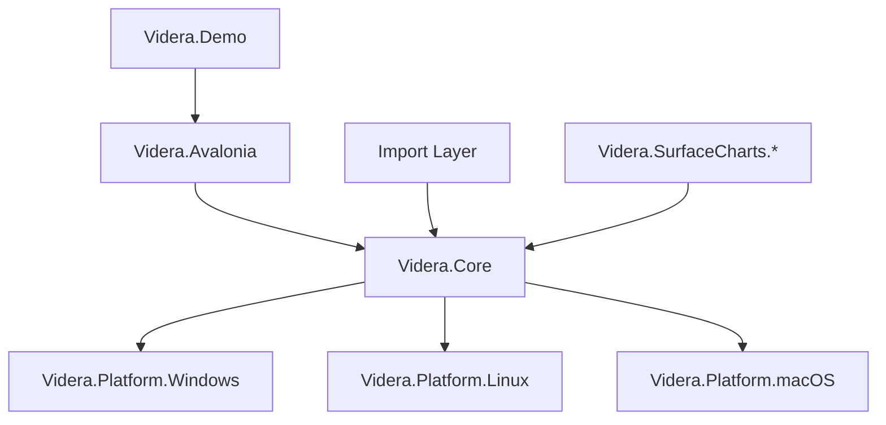
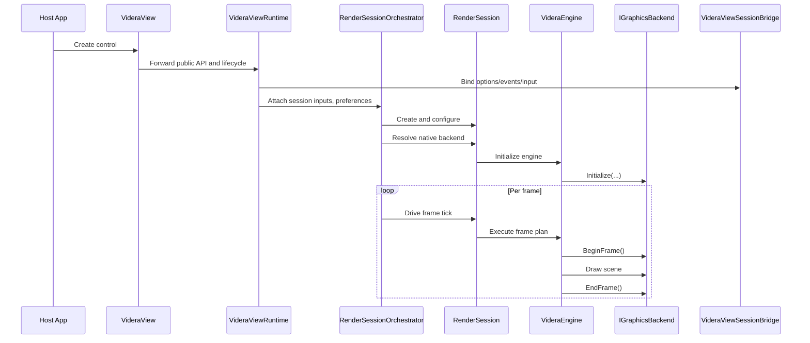

# Videra Architecture

[English](ARCHITECTURE.md) | [中文](docs/zh-CN/ARCHITECTURE.md)

This document describes Videra's public architecture boundaries, module responsibilities, and runtime flow for contributors and evaluators. Use [docs/hosting-boundary.md](docs/hosting-boundary.md) when you need the focused public-vs-internal seam ownership view for the shipped viewer path.

The `1.0` line is a native desktop viewer/runtime for Avalonia hosts, inspection workflows, and the public `SurfaceCharts` package family. It is not a general engine/runtime parity effort. One bounded style-driven broader-lighting baseline ships on the native static-scene path, but broader lighting/runtime breadth stays deferred. Use [docs/capability-matrix.md](docs/capability-matrix.md) for the explicit `1.0` boundary and deferred-feature matrix.

## Design Goals

Videra is designed to provide stable 3D viewer capabilities inside Avalonia desktop applications:

- Unify cross-platform 3D view behavior
- Keep core rendering logic decoupled from platform graphics APIs
- Select the most suitable native backend per platform
- Provide a software fallback for diagnostics and no-GPU environments
- Maintain clear boundaries between demo code, library code, and validation

## Layering



## Videra 1.0 Package Layers

| Layer | Responsibility |
| --- | --- |
| `Core` | Viewer/runtime kernel, scene truth, render pipeline, software fallback, and narrow extensibility |
| `Import` | Asset ingestion for viewer/runtime scenes |
| `Backend` | Native graphics implementations for `D3D11`, `Vulkan`, and `Metal` |
| `UI adapter` | Host-framework shell, orchestration, and input/presentation translation |
| `Charts` | `SurfaceChartView`, `WaterfallChartView`, `ScatterChartView`, and the shipped `Videra.SurfaceCharts.*` package line, independent from `VideraView` |

### `Videra.Core`

Platform-agnostic rendering layer responsible for:

- Rendering abstractions
- Scene object and engine lifecycle
- `SceneDocument` scene ownership and backend-neutral imported assets
- Scene/material runtime catalogs expressed as `SceneNode`, `MeshPrimitive`, `MaterialInstance`, `Texture2D`, and `Sampler`
- Camera, grid, axis, and wireframe logic
- Render-style presets
- Software fallback rendering
- Frame-plan construction and pipeline execution via `VideraEngine`

`Videra.Core` is the runtime kernel of the viewer stack. The `v1.20` boundary treats import as a distinct layer that composes with the kernel rather than redefining the whole product as a general engine.

Key abstractions:

- `IGraphicsBackend`
- `IGraphicsDevice`
- `IRenderSurface`
- `IResourceFactory`
- `ICommandExecutor`
- `GraphicsBackendFactory`

### `Videra.Avalonia`

UI integration layer responsible for:

- Hosting the `VideraView` UI shell
- Hosting the internal `VideraViewRuntime` coordinator for view-local state
- Host-agnostic orchestration through `RenderSessionOrchestrator`
- Coordinating render-session lifecycle and backend selection
- Hosting Avalonia-specific runtime/presentation adapters in `RenderSession`
- Translating view-level input/options/events through `VideraViewSessionBridge`
- Hosting scene-runtime services such as `SceneDocumentStore`, `SceneDeltaPlanner`, `SceneResidencyRegistry`, and `SceneUploadQueue`

This layer lets host apps use the 3D view from XAML or code without coupling UI surface code to rendering internals.

The shipped chart line is concrete rather than future-facing: `Videra.SurfaceCharts.Avalonia` currently exposes `SurfaceChartView`, `WaterfallChartView`, and `ScatterChartView`, while `Videra.SurfaceCharts.Processing` is only needed for the surface/cache-backed chart path.

### Import packages

Dedicated import packages own file-format parsing and CPU-side scene asset creation for viewer/runtime scenes:

- `Videra.Import.Gltf`: `.gltf` and `.glb`
- `Videra.Import.Obj`: `.obj`

These packages compose with `Videra.Core` directly. `Videra.Avalonia` does not consume them transitively; Avalonia hosts install `Videra.Import.Gltf` and/or `Videra.Import.Obj` explicitly and register importers through `VideraViewOptions.UseModelImporter(...)` when they need importer-backed `LoadModelAsync(...)` / `LoadModelsAsync(...)`.

## Scene and Material Runtime Truth

The viewer/runtime scene model is intentionally viewer-first instead of backend-first:

- `SceneDocument` is the retained scene truth for the active view.
- `ImportedSceneAsset` carries backend-neutral scene/material catalogs produced by the import layer.
- `SceneNode` owns node identity, hierarchy, and local transforms.
- `MeshPrimitive` attaches shared geometry and material references without collapsing node identity into one object.
- `MaterialInstance`, `Texture2D`, and `Sampler` are explicit runtime assets owned by the imported scene catalog.
- `SceneDocumentStore`, `SceneDeltaPlanner`, `SceneResidencyRegistry`, and `SceneUploadQueue` keep those retained assets CPU-side until a ready resource factory can realize them on the active backend.

The current shipped material/runtime baseline on that path is static glTF/PBR:

- UV coordinates and texture references become explicit `Texture2D` and `Sampler` runtime assets.
- `MeshPrimitive` preserves per-primitive non-Blend material participation so imported assets can keep primitive-level material truth intact.
- `MaterialInstance` carries metallic-roughness and alpha semantics plus emissive, occlusion texture binding/strength, and normal-map-ready inputs.
- `MaterialTextureBinding` carries `KHR_texture_transform` offset/scale/rotation plus texture-coordinate override as imported-asset/runtime truth.
- Imported assets retain tangent-aware mesh data as runtime truth instead of importer-only side channels.
- For repeated unchanged imports, retained imported scene assets can be reused before upload while those retained assets stay available, instead of rebuilding ad hoc importer-shaped state.
- The canonical runtime bridge may expand one imported entry into multiple internal runtime objects, so mixed opaque and transparent primitive participation can survive upload and residency without redefining the public scene-entry contract as a broader transparency system.

The current shipped baseline also includes one bounded style-driven broader-lighting baseline on the native static-scene path. The current renderer path consumes baseColor texture sampling, occlusion texture binding/strength, emissive inputs, and normal-map-ready inputs on the bounded static-scene seam, including `KHR_texture_transform` offset/scale/rotation and texture-coordinate override where those bindings request them. This remains a bounded renderer-consumption seam rather than a broader lighting/shader/backend promise, and the baseline remains narrower than a general runtime surface. Animation, skeletons, morph targets, broader lighting systems, shadows, environment maps, post-processing, extra UI adapters, Wayland/OpenGL/WebGL/backend API expansion, and broader advanced-runtime feature expansion stay deferred.

That split is what lets backend rebind/recovery rebuild scene resources from retained scene truth instead of depending on a long-lived staging mirror in the public API.

### Native Backend Packages

Each backend implements `IGraphicsBackend` against a native graphics API:

- `Videra.Platform.Windows`: Direct3D 11
- `Videra.Platform.Linux`: Vulkan
- `Videra.Platform.macOS`: Metal

These packages handle:

- Device initialization
- Swapchain / drawable lifecycle
- Depth-buffer and frame management
- Resource factories and command executors
- The direct internal `device/surface` seam used by `RenderSessionOrchestrator`; `LegacyGraphicsBackendAdapter` remains the compatibility bridge for older monolithic backends only

Built-in backend minimum contract:

- Portable: buffer creation, current-viewer pipeline creation, direct buffer binding, draw calls, viewport/scissor, clear, and standard frame depth behavior with best-effort `SetDepthState(...)` / `ResetDepthState()`
- Not a built-in portability promise: `CreateShader(...)`, `CreateResourceSet(...)`, and `SetResourceSet(...)`
- This architecture does not imply an `OpenGL` product promise; current native support remains Windows=`D3D11`, Linux=`Vulkan`, and macOS=`Metal`

### `Videra.Demo`

The demo application shows:

- `VideraView` integration
- Model import flows
- Render-style and wireframe switching
- Grid, axes, and basic object transforms
- Backend status and default scene bootstrapping

## Repository Layout

```text
Videra/
├── src/
│   ├── Videra.Core/
│   ├── Videra.Import.Gltf/
│   ├── Videra.Import.Obj/
│   ├── Videra.Avalonia/
│   ├── Videra.Platform.Windows/
│   ├── Videra.Platform.Linux/
│   └── Videra.Platform.macOS/
├── samples/
│   ├── Videra.Demo/
│   └── Videra.ExtensibilitySample/
├── tests/
├── docs/
└── scripts/
    ├── verify.sh
    └── verify.ps1
```

## Runtime Flow



## Render Pipeline Contract

Phase 11 keeps `VideraEngine` as the owner of frame-plan construction and pipeline execution. `RenderSessionOrchestrator` / `RenderSession` still decide *when* frames run, while public extensibility stays rooted in Core.

Stable stage vocabulary for one frame:

- `PrepareFrame`
- `BindSharedFrameState`
- `GridPass`
- `SolidGeometryPass`
- `WireframePass`
- `AxisPass`
- `PresentFrame`

Contract notes:

- `WireframePass` is conditional. Standard frames omit it, wireframe-overlay frames include it after `SolidGeometryPass`, and `WireframeOnly` frames skip `SolidGeometryPass`.
- `LastPipelineSnapshot` records the executed stages plus the effective pipeline profile for the last completed frame.
- `VideraView.BackendDiagnostics` mirrors the same read-only truth through `RenderPipelineProfile`, `LastFrameStageNames`, `LastFrameObjectCount`, `LastFrameOpaqueObjectCount`, `LastFrameTransparentObjectCount`, and `UsesSoftwarePresentationCopy`.
- `VideraView.RenderCapabilities` exposes the same Core-side capability snapshot to host apps.

Stable feature vocabulary for runtime, contributors, and host diagnostics:

- `Opaque`
- `Transparent`
- `Overlay`
- `Picking`
- `Screenshot`

Feature truth surfaces:

- `RenderCapabilities.SupportedFeatureNames`
- `LastPipelineSnapshot.FeatureNames`
- `VideraView.BackendDiagnostics.LastFrameFeatureNames`
- `VideraView.BackendDiagnostics.SupportedRenderFeatureNames`
- `VideraView.BackendDiagnostics.LastFrameObjectCount`, `LastFrameOpaqueObjectCount`, and `LastFrameTransparentObjectCount` are backend-neutral scene counts, not draw-call metrics or advanced rendering promises.

## Public Extensibility

Phase 11 ships a narrow public extensibility surface on top of the existing pipeline contract:

- `IRenderPassContributor` lets host apps register additional contributors for stable pass slots.
- `RegisterPassContributor(...)` adds contributors without replacing the built-in pipeline owner.
- `ReplacePassContributor(...)` replaces a stable built-in pass slot when an app needs to take over that stage.
- `RegisterFrameHook(...)` provides deterministic `RenderFrameHookPoint` callbacks at `FrameBegin`, `SceneSubmit`, and `FrameEnd`.
- `GetRenderCapabilities()` and `VideraView.RenderCapabilities` expose Core-side runtime/capability truth.
- `VideraView.BackendDiagnostics` remains the Avalonia-facing backend/runtime diagnostics shell.
- Shipped onboarding lives in [docs/extensibility.md](docs/extensibility.md) and [samples/Videra.ExtensibilitySample](samples/Videra.ExtensibilitySample/README.md).

Boundary notes:

- `VideraEngine` is the public extensibility root.
- `VideraViewRuntime`, `RenderSessionOrchestrator`, `RenderSession`, and `VideraViewSessionBridge` remain internal orchestration seams, not public extension roots.
- Before initialization, registrations can be queued, but `RenderCapabilities.IsInitialized` remains `false` and host apps should wait for readiness before `LoadModelAsync(...)` and `FrameAll()`.
- After `VideraEngine` is `disposed`, `RegisterPassContributor(...)`, `ReplacePassContributor(...)`, and `RegisterFrameHook(...)` are harmless `no-op` calls; `GetRenderCapabilities()` stays queryable and can retain the last pipeline snapshot.
- When a native backend is unavailable and `AllowSoftwareFallback` is enabled, the view resolves to software and `VideraView.BackendDiagnostics.FallbackReason` records the native failure reason.
- When `AllowSoftwareFallback` is disabled, backend resolution fails instead of populating `FallbackReason`, so host apps must fix the package/runtime gap before the view becomes ready.
- This milestone does not add package discovery or plugin loading for the new API surface.

Boundary summary:

- `VideraEngine` owns frame-plan and pipeline execution semantics.
- `VideraViewRuntime` owns view-local coordination, native-host lifecycle, overlay sync, and session forwarding.
- Inspection fidelity stays split across `VideraViewRuntime`, Core helpers, and a narrow `VideraInspectionBundleService` support surface instead of turning `VideraView` into a broader project-format API.
- `SceneDocument` is the authoritative viewer-scene contract; imported assets remain backend-neutral until a ready resource factory uploads them.
- `SceneDocumentStore` owns the current desired scene truth, while `SceneDeltaPlanner` and `SceneEngineApplicator` turn document changes plus typed retained-entry deltas into engine add/remove and residency work.
- `SceneResidencyRegistry` and `SceneUploadQueue` own per-entry upload state and frame-budgeted GPU realization; `SceneUploadQueue` coalesces repeated entry work, prefers attached dirty entries during interactive draining, and keeps backend rebind on the same queue path instead of synchronously allocating GPU resources on the public API path.
- `RenderSessionOrchestrator` owns host-agnostic session orchestration and rendering cadence.
- Built-in backends now satisfy the internal `IGraphicsDevice` / `IRenderSurface` split directly; `LegacyGraphicsBackendAdapter` is a compatibility seam, not the preferred steady-state path.
- `RenderSession` owns Avalonia-specific runtime/presentation adapter setup.
- `VideraViewSessionBridge` translates synchronized Avalonia view options/events into session-facing state updates.
- `VideraView` remains the UI shell and native-host/input surface.

## Backend Selection

Videra exposes two backend-selection paths:

1. `VideraView.PreferredBackend`
2. `VIDERA_BACKEND` environment variable

When set to `Auto`, the default preference is:

- Windows: `D3D11`
- Linux: `Vulkan`
- macOS: `Metal`

If the native backend is unavailable, or if `software` is selected explicitly, rendering falls back to the software path.

## Supported Capabilities

- Model import through `Videra.Import.Gltf` and `Videra.Import.Obj`: `.gltf`, `.glb`, `.obj`
- Orbit camera and basic scene interaction
- Viewer-first inspection workflows: mesh-accurate picking, measurement snap modes, snapshot export, and replayable inspection bundles
- Render-style presets
- Wireframe and overlay modes
- Grid and axis helpers
- Native rendering backends
- Software fallback backend

For the explicit `1.0` versus deferred capability split, use [docs/capability-matrix.md](docs/capability-matrix.md).

## Validation Strategy

Repository-wide validation entrypoints:

```bash
./scripts/verify.sh --configuration Release
pwsh -File ./scripts/verify.ps1 -Configuration Release
```

By default:

- Standard validation covers solution build, tests, and common checks through `scripts/verify.sh` / `scripts/verify.ps1`
- GitHub-hosted required checks additionally cover `windows-native`, `macos-native`, `linux-x11-native`, and `linux-wayland-xwayland-native`
- Linux Wayland sessions are validated through the XWayland compatibility path, not compositor-native embedding

## Current Limits

- Videra targets componentized 3D viewing rather than a full content creation pipeline
- Linux native support currently means `X11` plus `Wayland` sessions running through `XWayland` compatibility fallback
- The macOS backend relies on Objective-C runtime interop
- Public extensibility is C#-first and in-process; package discovery and plugin loading are still out of scope

## Related Docs

- [README.md](README.md)
- [Hosting Boundary](docs/hosting-boundary.md)
- [Documentation Index](docs/index.md)
- [Extensibility Contract](docs/extensibility.md)
- [Troubleshooting](docs/troubleshooting.md)
- [Chinese Architecture Doc](docs/zh-CN/ARCHITECTURE.md)
