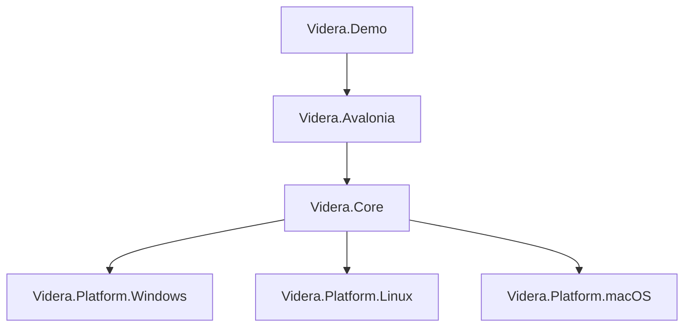
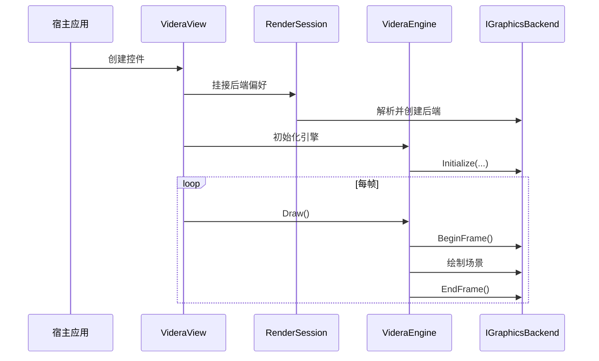

# Videra 架构说明

本文档描述 Videra 的公开架构边界、模块职责和运行方式，面向首次阅读仓库的开发者与贡献者。

## 设计目标

Videra 的设计目标不是实现通用游戏引擎，而是在 Avalonia 桌面应用中提供一套稳定的 3D 查看组件能力：

- 统一封装跨平台 3D 视图能力
- 保持核心渲染逻辑与平台图形 API 解耦
- 允许按平台接入最合适的原生后端
- 在无 GPU 或调试场景下提供软件回退路径
- 让 Demo、库代码和测试验证形成清晰边界

## 分层结构



### `Videra.Core`

平台无关的核心层，负责：

- 渲染抽象接口
- 场景对象与引擎生命周期
- 相机、网格、坐标轴与线框渲染逻辑
- 模型导入
- 渲染风格系统
- 软件渲染回退

关键抽象：

- `IGraphicsBackend`
- `IResourceFactory`
- `ICommandExecutor`
- `GraphicsBackendFactory`

### `Videra.Avalonia`

UI 集成层，负责：

- `VideraView` 控件暴露
- Avalonia 与原生窗口宿主的桥接
- 后端偏好与渲染会话调度
- 指针输入与相机交互映射

这一层屏蔽了 UI 框架与底层后端的耦合，使宿主应用可以通过 XAML 或代码直接使用 3D 视图。

### 平台后端

每个平台后端都实现 `IGraphicsBackend` 契约，并对接各自的原生图形 API：

- `Videra.Platform.Windows`: Direct3D 11
- `Videra.Platform.Linux`: Vulkan
- `Videra.Platform.macOS`: Metal

它们负责：

- 原生图形设备初始化
- 交换链或可绘制对象管理
- 深度缓冲与帧生命周期
- 资源工厂与命令执行器实现

### `Videra.Demo`

示例应用，负责展示：

- `VideraView` 集成方式
- 模型导入
- 渲染风格与线框切换
- 网格、坐标轴和基础对象变换
- 平台后端选择与状态展示

## 目录结构

```text
Videra/
├── src/
│   ├── Videra.Core/
│   ├── Videra.Avalonia/
│   ├── Videra.Platform.Windows/
│   ├── Videra.Platform.Linux/
│   └── Videra.Platform.macOS/
├── samples/
│   └── Videra.Demo/
├── tests/
├── docs/
├── verify.sh
└── verify.ps1
```

## 运行流程



## 后端选择策略

Videra 提供显式偏好与环境变量两条路径：

1. `VideraView.PreferredBackend`
2. `VIDERA_BACKEND` 环境变量

当设置为 `Auto` 时，默认按平台选择：

- Windows: `D3D11`
- Linux: `Vulkan`
- macOS: `Metal`

当原生后端不可用或显式指定 `software` 时，会进入软件渲染路径。

## 支持的核心能力

- 3D 模型导入：`.gltf`、`.glb`、`.obj`
- 轨道相机与基础交互
- 渲染风格预设
- 线框渲染与叠加模式
- 网格和坐标轴辅助
- 平台原生渲染后端
- 软件回退后端

## 验证策略

仓库提供统一验证入口：

```bash
./verify.sh --configuration Release
pwsh -File ./verify.ps1 -Configuration Release
```

其中：

- 标准验证覆盖解决方案构建、测试和通用检查
- Linux 原生验证需显式开启 `--include-native-linux`
- macOS 原生验证需显式开启 `--include-native-macos`

Windows 路径已纳入真实 HWND 验证；Linux 和 macOS 的完整原生闭环仍需要在对应宿主系统上执行。

## 当前边界与限制

- 当前目标是组件化 3D Viewer，而非完整内容制作工具链
- Linux 原生路径当前以 X11 为主，Wayland 暂不支持
- macOS 后端目前依赖 Objective-C runtime 互操作
- 平台后端均可继续在稳定性、封装性和原生宿主验证方面迭代

## 相关文档

- [README.md](README.md)
- [docs/index.md](docs/index.md)
- [docs/troubleshooting.md](docs/troubleshooting.md)
- [src/Videra.Core/README.md](src/Videra.Core/README.md)
- [src/Videra.Avalonia/README.md](src/Videra.Avalonia/README.md)
- [samples/Videra.Demo/README.md](samples/Videra.Demo/README.md)
