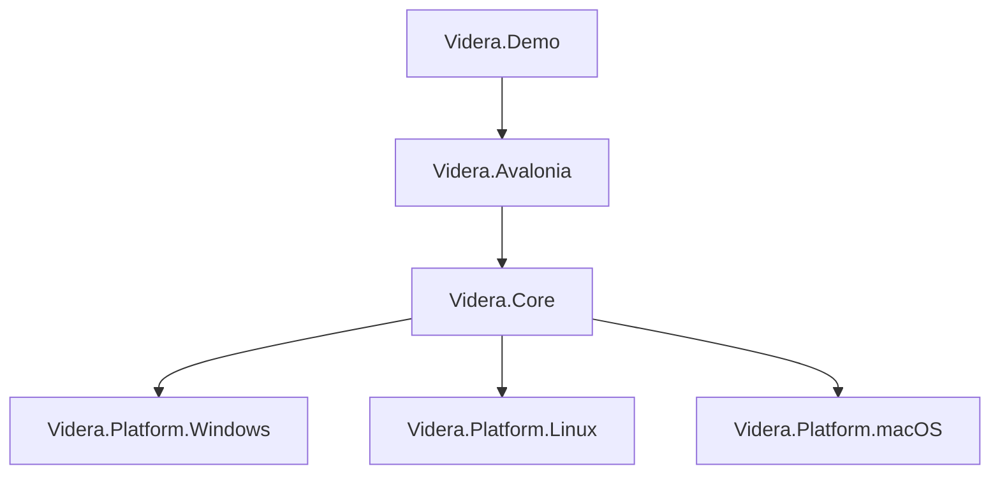
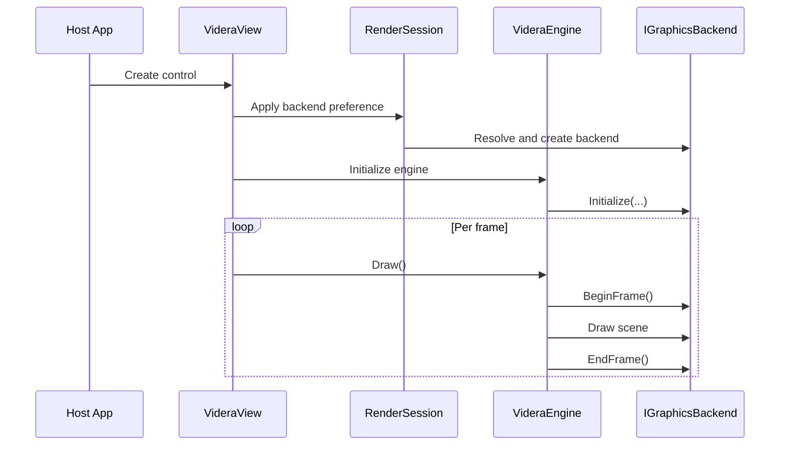

# Videra Architecture

[English](ARCHITECTURE.md) | [中文](docs/zh-CN/ARCHITECTURE.md)

This document describes Videra's public architecture boundaries, module responsibilities, and runtime flow for contributors and evaluators.

## Design Goals

Videra is designed to provide stable 3D viewer capabilities inside Avalonia desktop applications:

- Unify cross-platform 3D view behavior
- Keep core rendering logic decoupled from platform graphics APIs
- Select the most suitable native backend per platform
- Provide a software fallback for diagnostics and no-GPU environments
- Maintain clear boundaries between demo code, library code, and validation

## Layering



### `Videra.Core`

Platform-agnostic rendering layer responsible for:

- Rendering abstractions
- Scene object and engine lifecycle
- Camera, grid, axis, and wireframe logic
- Model import
- Render-style presets
- Software fallback rendering

Key abstractions:

- `IGraphicsBackend`
- `IResourceFactory`
- `ICommandExecutor`
- `GraphicsBackendFactory`

### `Videra.Avalonia`

UI integration layer responsible for:

- The `VideraView` control surface
- Bridging Avalonia with native-host handles
- Backend preference and render-session coordination
- Pointer input and camera interaction mapping

This layer lets host apps use the 3D view from XAML or code without directly coupling UI code to backend implementation details.

### Native Backend Packages

Each backend implements `IGraphicsBackend` against a native graphics API:

- `Videra.Platform.Windows`: Direct3D 11
- `Videra.Platform.Linux`: Vulkan
- `Videra.Platform.macOS`: Metal

These packages handle:

- Device initialization
- Swapchain / drawable lifecycle
- Depth-buffer and frame management
- Resource factories and command executors

### `Videra.Demo`

The demo application shows:

- `VideraView` integration
- Model import flows
- Render-style and wireframe switching
- Grid, axes, and basic object transforms
- Backend status and default scene bootstrapping

## Repository Layout

```text
Videra/
├── src/
│   ├── Videra.Core/
│   ├── Videra.Avalonia/
│   ├── Videra.Platform.Windows/
│   ├── Videra.Platform.Linux/
│   └── Videra.Platform.macOS/
├── samples/
│   └── Videra.Demo/
├── tests/
├── docs/
├── verify.sh
└── verify.ps1
```

## Runtime Flow



## Backend Selection

Videra exposes two backend-selection paths:

1. `VideraView.PreferredBackend`
2. `VIDERA_BACKEND` environment variable

When set to `Auto`, the default preference is:

- Windows: `D3D11`
- Linux: `Vulkan`
- macOS: `Metal`

If the native backend is unavailable, or if `software` is selected explicitly, rendering falls back to the software path.

## Supported Capabilities

- Model import: `.gltf`, `.glb`, `.obj`
- Orbit camera and basic scene interaction
- Render-style presets
- Wireframe and overlay modes
- Grid and axis helpers
- Native rendering backends
- Software fallback backend

## Validation Strategy

Repository-wide validation entrypoints:

```bash
./verify.sh --configuration Release
pwsh -File ./verify.ps1 -Configuration Release
```

By default:

- Standard validation covers solution build, tests, and common checks
- Linux native validation requires `--include-native-linux`
- macOS native validation requires `--include-native-macos`

Windows lifecycle coverage is already part of the standard validation path. Linux and macOS native-host end-to-end validation still needs to be run on those hosts explicitly.

## Current Limits

- Videra targets componentized 3D viewing rather than a full content creation pipeline
- Linux native support is currently X11-first; Wayland is not yet supported
- The macOS backend relies on Objective-C runtime interop
- All native backends can still improve in stability, encapsulation, and host validation depth

## Related Docs

- [README.md](README.md)
- [Documentation Index](docs/index.md)
- [Troubleshooting](docs/troubleshooting.md)
- [Chinese Architecture Doc](docs/zh-CN/ARCHITECTURE.md)
