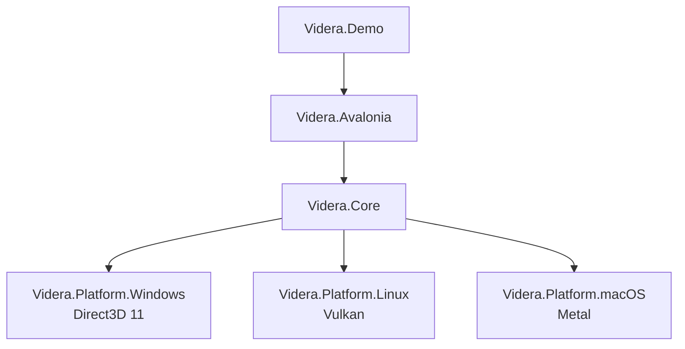

# Videra

[English](README.md) | [中文](docs/zh-CN/README.md)


Videra is a Cross-platform 3D viewer component stack for .NET desktop applications. Its primary goal is to provide reusable, embeddable, and extensible 3D viewing capabilities inside Avalonia apps.

Videra is not a general-purpose game engine. It is designed around desktop 3D viewing and interaction workflows, with a shared rendering core and native graphics backends for Windows, Linux, and macOS.

## Status

- Early `alpha`
- Current package baseline: `0.1.0-alpha.1`
- API shape, package layout, and some platform behavior may still change before `1.0`
- GitHub Packages distribution currently fits Windows + Avalonia evaluation best; Linux and macOS native backends are still better validated from source

## Highlights

- `VideraView` Avalonia control for direct XAML integration
- Native graphics backends
  - Windows: Direct3D 11
  - Linux: Vulkan (`X11` native path, `XWayland` compatibility inside Wayland sessions)
  - macOS: Metal
- Software fallback path for non-GPU and diagnostics scenarios
- Shared abstractions: `IGraphicsBackend`, `IResourceFactory`, `ICommandExecutor`
- Model import for `.gltf`, `.glb`, and `.obj`
- Render-style presets and wireframe modes
- Public extensibility contract plus a narrow `Videra.ExtensibilitySample` onboarding path
- Controlled interaction contract plus a focused `Videra.InteractionSample` onboarding path
- Surface-chart module family for large offline matrix data, centered on `SurfaceChartView` and shipped as a sibling boundary to `VideraView`
- Demo app with backend diagnostics, import feedback, a default demo cube, camera control, grid, axes, and basic transforms

## Architecture



The repository is split into UI integration, a platform-agnostic rendering core, native backend packages, and a demo application. See [ARCHITECTURE.md](ARCHITECTURE.md) for a fuller breakdown.

## Repository Layout

| Path | Purpose |
| --- | --- |
| `src/Videra.Core` | Platform-agnostic rendering core, abstractions, import, and style systems |
| `src/Videra.Avalonia` | Avalonia control layer and native host integration |
| `src/Videra.Platform.Windows` | Windows Direct3D 11 backend |
| `src/Videra.Platform.Linux` | Linux Vulkan backend |
| `src/Videra.Platform.macOS` | macOS Metal backend |
| `src/Videra.SurfaceCharts.Core` | Surface-chart domain contracts and LOD selection |
| `src/Videra.SurfaceCharts.Avalonia` | Dedicated `SurfaceChartView` control layer |
| `src/Videra.SurfaceCharts.Processing` | Surface cache and pyramid generation |
| `samples/Videra.Demo` | Demo application and usage reference |
| `samples/Videra.SurfaceCharts.Demo` | Independent surface-chart demo application |
| `samples/Videra.ExtensibilitySample` | Narrow public sample for contributors, frame hooks, capabilities, and diagnostics |
| `samples/Videra.InteractionSample` | Focused public sample for host-owned selection state, annotation state, and mode switching |
| `docs` | Long-lived documentation, troubleshooting, ADRs, and archive |

## Platform Support

| Platform | Default Backend | Current State | Notes |
| --- | --- | --- | --- |
| Windows 10+ | Direct3D 11 | Usable | Repository validation covers real HWND-backed paths |
| Linux | Vulkan | Usable | Native embedding uses X11; in Wayland sessions `Auto` resolves to an `XWayland` compatibility path when available |
| macOS 10.15+ | Metal | Usable | Depends on Objective-C runtime and `CAMetalLayer` interop |
| Any platform | Software | Fallback | Useful for CI, diagnostics, or no-GPU scenarios |

## Getting Started

### Requirements

- .NET 8 SDK
- Git
- Platform graphics prerequisites
  - Windows: Direct3D 11-capable GPU
  - Linux: Vulkan drivers and X11 runtime libraries
  - macOS: Metal-capable hardware

### Build from Source

```bash
git clone https://github.com/ExplodingUFO/Videra.git
cd Videra
dotnet restore
dotnet build Videra.slnx
```

### Install Alpha Packages from GitHub Packages

Videra pre-release packages are currently distributed through GitHub Packages rather than the public NuGet.org feed.

Configure the package source:

```bash
dotnet nuget add source "https://nuget.pkg.github.com/ExplodingUFO/index.json" \
  --name github-ExplodingUFO \
  --username YOUR_GITHUB_USER \
  --password YOUR_GITHUB_PAT \
  --store-password-in-clear-text
```

- `YOUR_GITHUB_USER`: your GitHub username
- `YOUR_GITHUB_PAT`: a token with at least `read:packages`

Recommended package combinations:

```bash
dotnet add package Videra.Avalonia --version 0.1.0-alpha.1 --source github-ExplodingUFO
```

For Avalonia apps, install `Videra.Avalonia` and exactly one matching platform package:

```bash
# Windows
dotnet add package Videra.Platform.Windows --version 0.1.0-alpha.1 --source github-ExplodingUFO

# Linux
dotnet add package Videra.Platform.Linux --version 0.1.0-alpha.1 --source github-ExplodingUFO

# macOS
dotnet add package Videra.Platform.macOS --version 0.1.0-alpha.1 --source github-ExplodingUFO
```

If you only need the rendering abstractions and import pipeline, install `Videra.Core` directly:

```bash
dotnet add package Videra.Core --version 0.1.0-alpha.1 --source github-ExplodingUFO
```

`Videra.Avalonia` remains the UI/control entry package. The software fallback path can still help with diagnostics when no native backend is available, but it does not install missing platform packages.

`PreferredBackend` and `VIDERA_BACKEND` only change backend preference. They do not install missing platform packages and do not replace matching-host native validation.

### Run the Demo

```bash
dotnet run --project samples/Videra.Demo/Videra.Demo.csproj
```

The sample app seeds a default demo cube when backend initialization succeeds, surfaces backend diagnostics in the demo status area, and reports import feedback there as models load or fail.

### Run the Surface Charts Demo

```bash
dotnet run --project samples/Videra.SurfaceCharts.Demo/Videra.SurfaceCharts.Demo.csproj
```

The surface-chart demo is a separate Avalonia app that currently focuses on the chart data path and module boundary:

- switching between an in-memory source and a cache-backed source
- switching between overview and zoomed-detail viewports
- exercising overview-first LOD and lazy tile loading

Current alpha limitations are important:

- full built-in mouse orbit / pan / zoom interaction is not complete yet
- axis, tick, label, and legend presentation is not complete yet
- the demo currently uses host-driven viewport presets rather than a finished interactive chart camera

### Verify the Repository

```bash
# Unix shell
./verify.sh --configuration Release

# PowerShell
pwsh -File ./verify.ps1 -Configuration Release
```

Default verification does not automatically cover Linux or macOS native-host end-to-end paths. Enable them explicitly when needed:

```bash
./verify.sh --configuration Release --include-native-linux
./verify.sh --configuration Release --include-native-linux-xwayland
./verify.sh --configuration Release --include-native-macos

pwsh -File ./verify.ps1 -Configuration Release -IncludeNativeLinux
pwsh -File ./verify.ps1 -Configuration Release -IncludeNativeLinuxXWayland
pwsh -File ./verify.ps1 -Configuration Release -IncludeNativeMacOS
```

GitHub Actions now runs matching-host native validation for Linux X11, Linux Wayland-session `XWayland`, macOS, and Windows on pull requests through `.github/workflows/native-validation.yml`. Use the dedicated [Native Validation runbook](docs/native-validation.md) when you want to inspect that CI path, use `Run workflow` for targeted reruns, or reproduce failures locally on a matching host.

## Avalonia Integration Example

```xml
<Window xmlns:videra="using:Videra.Avalonia.Controls">
    <videra:VideraView
        x:Name="VideraView"
        BackgroundColor="{Binding BackgroundColor}"
        RenderStyle="{Binding ActiveRenderStyle}"
        WireframeMode="Overlay"
        IsGridVisible="True"
        PreferredBackend="Auto" />
</Window>
```

```csharp
using Videra.Avalonia.Controls;
using Videra.Core.Graphics;

var view = new VideraView
{
    Options = new VideraViewOptions
    {
        Backend =
        {
            PreferredBackend = GraphicsBackendPreference.Auto,
            EnvironmentOverrideMode = BackendEnvironmentOverrideMode.Disabled,
            AllowSoftwareFallback = true
        }
    },
    IsGridVisible = true
};

var loadResult = await view.LoadModelAsync("Assets/model.glb");
if (loadResult.Succeeded)
{
    view.FrameAll();
}

var diagnostics = view.BackendDiagnostics;
Console.WriteLine($"Requested={diagnostics.RequestedBackend}, Resolved={diagnostics.ResolvedBackend}, Ready={diagnostics.IsReady}");
```

## Extensibility Onboarding

Use [Videra.ExtensibilitySample](samples/Videra.ExtensibilitySample/README.md) as the narrow public reference and [docs/extensibility.md](docs/extensibility.md) as the long-lived behavior contract.

The supported flow is `VideraView.Engine` -> `RegisterPassContributor(...)` / `RegisterFrameHook(...)` -> `LoadModelAsync(...)` -> `FrameAll()` -> inspect `RenderCapabilities` and `BackendDiagnostics`.

Contract highlights:

- After the engine is `disposed`, additional contributor and hook registrations are ignored as a `no-op`.
- `RenderCapabilities` remains queryable before initialization and after disposal, with `IsInitialized = false` until the engine is ready.
- When `AllowSoftwareFallback = true`, native backend failures resolve to software and `BackendDiagnostics.FallbackReason` explains why the native backend was unavailable.
- When `AllowSoftwareFallback = false`, native backend resolution fails instead of silently falling back, so the view does not become ready until the package/runtime issue is fixed.
- `package discovery` and `plugin loading` remain out of scope for the public extension model.

## Interaction Onboarding

Use [Videra.InteractionSample](samples/Videra.InteractionSample/README.md) as the focused public reference for controlled viewer interaction.

Contract highlights:

- The `host owns` `SelectionState`, `Annotations`, and annotation state.
- Built-in interaction modes are `Navigate`, `Select`, and `Annotate`.
- Selection is object-level and changes only when the host applies `SelectionRequested`.
- Annotation clicks surface `AnnotationRequested` for either object anchors or world-point anchors.
- Hosts typically materialize those anchors through `VideraNodeAnnotation` and `VideraWorldPointAnnotation`.
- Overlay responsibilities are split between `3D highlight/render state` and `2D label/feedback rendering`.

## Surface Charts Onboarding

Use [Videra.SurfaceCharts.Demo](samples/Videra.SurfaceCharts.Demo/README.md) as the public reference for the independent surface-chart module family.

Contract highlights:

- The surface-chart module family is a sibling product area, independent from `VideraView`.
- The dedicated `SurfaceChartView` control lives in `Videra.SurfaceCharts.Avalonia`.
- `Videra.SurfaceCharts.Demo` is the independent demo application for the surface-chart module family.
- `Videra.SurfaceCharts.Core` owns chart-domain models, tile identities, probe contracts, and LOD selection.
- `Videra.SurfaceCharts.Processing` owns cache and pyramid generation.
- `Videra.SurfaceCharts.Avalonia` owns the UI shell and Avalonia-specific overlay behavior.

## Packages

| Package | Use |
| --- | --- |
| `Videra.Avalonia` | Main Avalonia integration entry point |
| `Videra.Core` | Platform-agnostic rendering abstractions and import pipeline |
| `Videra.Platform.Windows` | Windows Direct3D 11 backend package |
| `Videra.Platform.Linux` | Linux Vulkan backend package |
| `Videra.Platform.macOS` | macOS Metal backend package |
| `Videra.SurfaceCharts.Core` | Surface-chart domain contracts and LOD selection |
| `Videra.SurfaceCharts.Avalonia` | Dedicated `SurfaceChartView` control and overlay behavior |
| `Videra.SurfaceCharts.Processing` | Surface cache and pyramid generation |
| `Videra.SurfaceCharts.Demo` | Independent surface-chart demo |

Detailed package-level docs:

- [Videra.Core](src/Videra.Core/README.md)
- [Videra.Avalonia](src/Videra.Avalonia/README.md)
- [Videra.Platform.Windows](src/Videra.Platform.Windows/README.md)
- [Videra.Platform.Linux](src/Videra.Platform.Linux/README.md)
- [Videra.Platform.macOS](src/Videra.Platform.macOS/README.md)
- [Videra.SurfaceCharts.Core](src/Videra.SurfaceCharts.Core/README.md)
- [Videra.SurfaceCharts.Avalonia](src/Videra.SurfaceCharts.Avalonia/README.md)
- [Videra.SurfaceCharts.Processing](src/Videra.SurfaceCharts.Processing/README.md)
- [Videra.Demo](samples/Videra.Demo/README.md)
- [Videra.SurfaceCharts.Demo](samples/Videra.SurfaceCharts.Demo/README.md)
- [Videra.ExtensibilitySample](samples/Videra.ExtensibilitySample/README.md)
- [Videra.InteractionSample](samples/Videra.InteractionSample/README.md)

## Environment Variables

| Variable | Purpose | Values |
| --- | --- | --- |
| `VIDERA_BACKEND` | Force a rendering backend | `software`, `d3d11`, `vulkan`, `metal`, `auto` |
| `VIDERA_FRAMELOG` | Enable frame logging | `1`, `true` |
| `VIDERA_INPUTLOG` | Enable input logging | `1`, `true` |

`VIDERA_BACKEND` is a backend-selection preference only. It does not install missing platform packages, and it does not replace matching-host native validation.

## Current Boundaries

- Videra is a component-oriented 3D viewer stack, not a full content creation toolchain
- The current GitHub Packages alpha path is best treated as a Windows + Avalonia evaluation track
- Linux native rendering currently embeds through X11 handles; Wayland sessions rely on an `XWayland` compatibility path when available
- Linux and macOS native-host validation is expected to pass on matching-host GitHub Actions pull requests; local matching-host runs remain the fallback for targeted debugging
- The macOS backend currently relies on Objective-C runtime interop

## Documentation

- [Documentation Index](docs/index.md)
- [Extensibility Contract](docs/extensibility.md)
- [Architecture](ARCHITECTURE.md)
- [Troubleshooting](docs/troubleshooting.md)
- [Native Validation](docs/native-validation.md)
- [Contributing](CONTRIBUTING.md)
- [Chinese Documentation Entry](docs/zh-CN/index.md)
- [Archive](docs/archive/README.md)

## Contributing

Issues, documentation fixes, and pull requests are welcome. Start with [CONTRIBUTING.md](CONTRIBUTING.md).

## License

Released under the [MIT License](LICENSE.txt).
