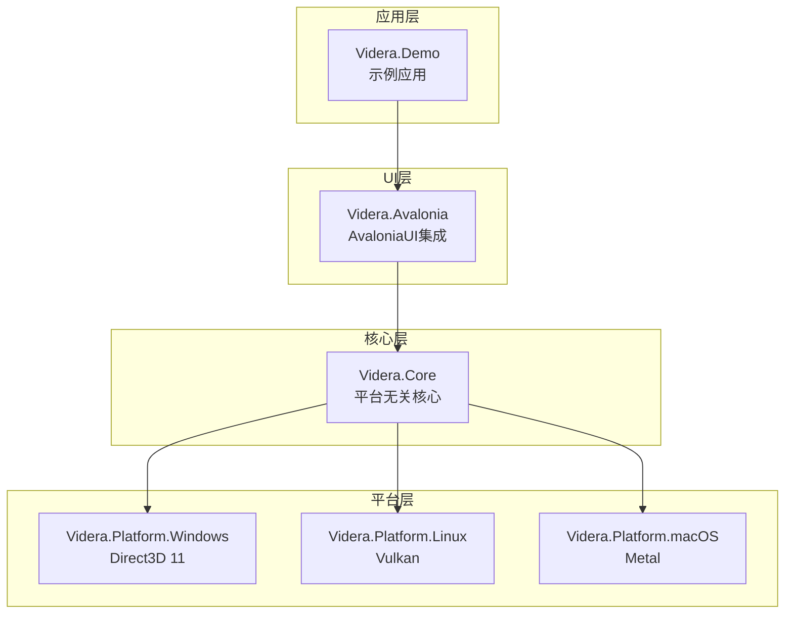
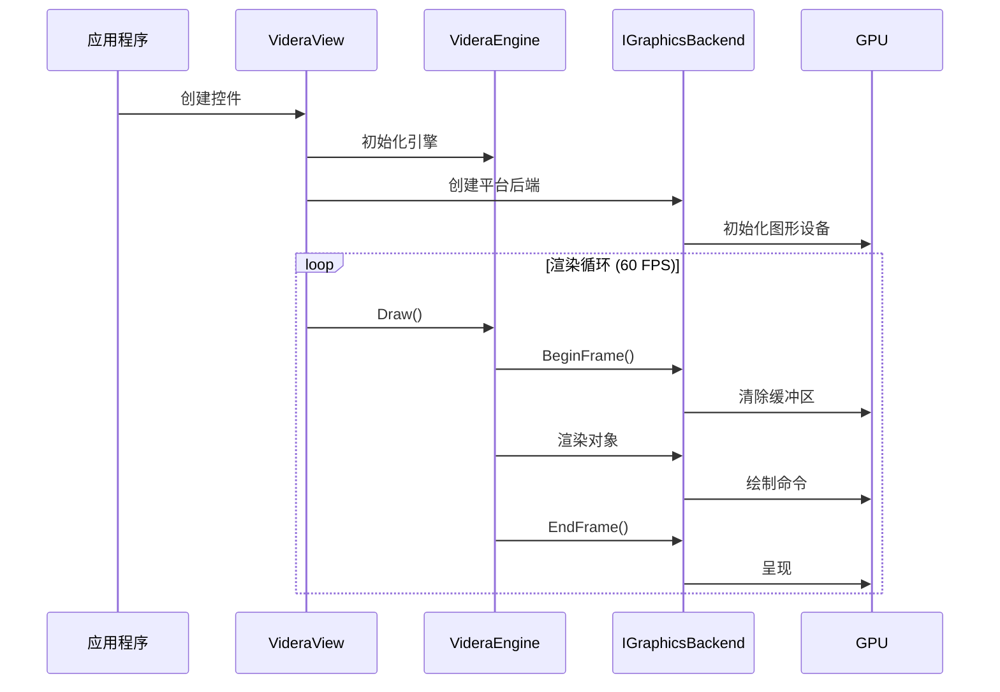
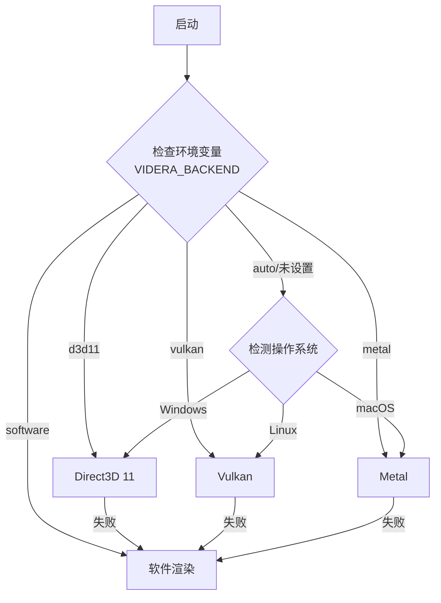

# Videra - 跨平台3D渲染引擎

  

**Videra** 是一个基于 **Avalonia UI** 构建的高性能、跨平台 3D 模型查看器组件，使用各平台原生图形API（Direct3D 11、Vulkan、Metal）实现高性能渲染。

## 项目架构



## 模块说明

| 模块 | 说明 | 技术栈 |
|------|------|--------|
| [Videra.Core](src/Videra.Core/README.md) | 平台无关的核心渲染逻辑 | .NET 8, System.Numerics |
| [Videra.Avalonia](src/Videra.Avalonia/README.md) | AvaloniaUI控件集成 | Avalonia 11.x |
| [Videra.Platform.Windows](src/Videra.Platform.Windows/README.md) | Windows D3D11后端 | Silk.NET.Direct3D11 |
| [Videra.Platform.Linux](src/Videra.Platform.Linux/README.md) | Linux Vulkan后端 | Silk.NET.Vulkan |
| [Videra.Platform.macOS](src/Videra.Platform.macOS/README.md) | macOS Metal后端 | Objective-C Runtime |
| [Videra.Demo](samples/Videra.Demo/README.md) | 示例应用程序 | Avalonia MVVM |

## 渲染流程



## 后端选择流程



## 快速开始

### 1. 安装依赖

```bash
dotnet restore
```

### 2. 运行示例

```bash
cd samples/Videra.Demo
dotnet run
```

### 3. 在项目中使用

```xml
<!-- XAML -->
<controls:VideraView Name="View3D"
                     Items="{Binding SceneObjects}"
                     BackgroundColor="{Binding BgColor}"
                     IsGridVisible="True"/>
```

```csharp
// C#
var view = new VideraView();
view.Engine.AddObject(myObject3D);
```

## 鼠标控制

| 操作 | 描述 |
|------|------|
| 左键拖拽 | 旋转视角 (Orbit) |
| 右键拖拽 | 平移视角 (Pan) |
| 滚轮滚动 | 缩放视角 (Zoom) |

## 环境变量

| 变量名 | 说明 | 可选值 |
|--------|------|--------|
| VIDERA_BACKEND | 强制指定渲染后端 | software, d3d11, vulkan, metal, auto |
| VIDERA_FRAMELOG | 启用帧日志 | 1, true |
| VIDERA_INPUTLOG | 启用输入日志 | 1, true |

## 系统要求

### Windows
- Windows 10 或更高版本
- Direct3D 11 兼容显卡
- .NET 8 Runtime

### Linux
- X11 窗口系统
- Vulkan 1.2+ 兼容显卡
- .NET 8 Runtime

### macOS
- macOS 10.15 或更高版本
- Metal 兼容显卡
- .NET 8 Runtime

## 构建

```bash
# 构建所有项目
dotnet build

# 统一验证脚本（Unix shell）
./verify.sh --configuration Release

# 在 Linux 原生主机上追加 Linux native validation
./verify.sh --configuration Release --include-native-linux

# 在 macOS 原生主机上追加 macOS native validation
./verify.sh --configuration Release --include-native-macos

# PowerShell 验证脚本
pwsh -File ./verify.ps1 -Configuration Release
pwsh -File ./verify.ps1 -Configuration Release -IncludeNativeLinux
pwsh -File ./verify.ps1 -Configuration Release -IncludeNativeMacOS

# 发布 Windows 版本
dotnet publish -c Release -r win-x64

# 发布 Linux 版本
dotnet publish -c Release -r linux-x64

# 发布 macOS 版本
dotnet publish -c Release -r osx-x64
```

## 许可证

MIT License
