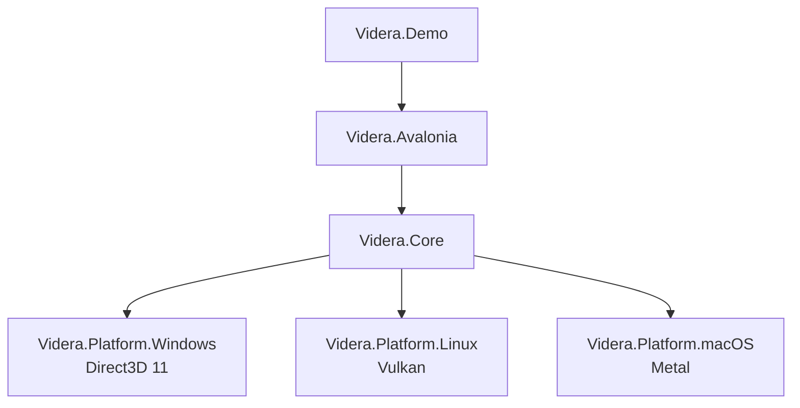

# Videra

[English](README.md) | [中文](docs/zh-CN/README.md)


Videra is a Cross-platform 3D viewer component stack for .NET desktop applications. Its primary goal is to provide reusable, embeddable, and extensible 3D viewing capabilities inside Avalonia apps.

Videra is not a general-purpose game engine. It is designed around desktop 3D viewing and interaction workflows, with a shared rendering core and native graphics backends for Windows, Linux, and macOS.

## Status

- Early `alpha`
- Current package baseline: `0.1.0-alpha.1`
- API shape, package layout, and some platform behavior may still change before `1.0`
- GitHub Packages distribution currently fits Windows + Avalonia evaluation best; Linux and macOS native backends are still better validated from source

## Highlights

- `VideraView` Avalonia control for direct XAML integration
- Native graphics backends
  - Windows: Direct3D 11
  - Linux: Vulkan (current native path is X11-based)
  - macOS: Metal
- Software fallback path for non-GPU and diagnostics scenarios
- Shared abstractions: `IGraphicsBackend`, `IResourceFactory`, `ICommandExecutor`
- Model import for `.gltf`, `.glb`, and `.obj`
- Render-style presets and wireframe modes
- Demo app with camera control, grid, axes, model import, and basic transforms

## Architecture



The repository is split into UI integration, a platform-agnostic rendering core, native backend packages, and a demo application. See [ARCHITECTURE.md](ARCHITECTURE.md) for a fuller breakdown.

## Repository Layout

| Path | Purpose |
| --- | --- |
| `src/Videra.Core` | Platform-agnostic rendering core, abstractions, import, and style systems |
| `src/Videra.Avalonia` | Avalonia control layer and native host integration |
| `src/Videra.Platform.Windows` | Windows Direct3D 11 backend |
| `src/Videra.Platform.Linux` | Linux Vulkan backend |
| `src/Videra.Platform.macOS` | macOS Metal backend |
| `samples/Videra.Demo` | Demo application and usage reference |
| `docs` | Long-lived documentation, troubleshooting, ADRs, and archive |

## Platform Support

| Platform | Default Backend | Current State | Notes |
| --- | --- | --- | --- |
| Windows 10+ | Direct3D 11 | Usable | Repository validation covers real HWND-backed paths |
| Linux | Vulkan | Usable | Current native path targets X11; Wayland is not yet supported |
| macOS 10.15+ | Metal | Usable | Depends on Objective-C runtime and `CAMetalLayer` interop |
| Any platform | Software | Fallback | Useful for CI, diagnostics, or no-GPU scenarios |

## Getting Started

### Requirements

- .NET 8 SDK
- Git
- Platform graphics prerequisites
  - Windows: Direct3D 11-capable GPU
  - Linux: Vulkan drivers and X11 runtime libraries
  - macOS: Metal-capable hardware

### Build from Source

```bash
git clone https://github.com/ExplodingUFO/Videra.git
cd Videra
dotnet restore
dotnet build Videra.slnx
```

### Install Alpha Packages from GitHub Packages

Videra pre-release packages are currently distributed through GitHub Packages rather than the public NuGet.org feed.

Configure the package source:

```bash
dotnet nuget add source "https://nuget.pkg.github.com/ExplodingUFO/index.json" \
  --name github-ExplodingUFO \
  --username YOUR_GITHUB_USER \
  --password YOUR_GITHUB_PAT \
  --store-password-in-clear-text
```

- `YOUR_GITHUB_USER`: your GitHub username
- `YOUR_GITHUB_PAT`: a token with at least `read:packages`

Recommended entry package:

```bash
dotnet add package Videra.Avalonia --version 0.1.0-alpha.1 --source github-ExplodingUFO
```

If you only need the rendering abstractions and import pipeline:

```bash
dotnet add package Videra.Core --version 0.1.0-alpha.1 --source github-ExplodingUFO
```

### Run the Demo

```bash
dotnet run --project samples/Videra.Demo/Videra.Demo.csproj
```

### Verify the Repository

```bash
# Unix shell
./verify.sh --configuration Release

# PowerShell
pwsh -File ./verify.ps1 -Configuration Release
```

Default verification does not automatically cover Linux or macOS native-host end-to-end paths. Enable them explicitly when needed:

```bash
./verify.sh --configuration Release --include-native-linux
./verify.sh --configuration Release --include-native-macos

pwsh -File ./verify.ps1 -Configuration Release -IncludeNativeLinux
pwsh -File ./verify.ps1 -Configuration Release -IncludeNativeMacOS
```

For matching-host Linux/macOS validation, or to close the remaining `TEST-03` execution gap, use the dedicated [Native Validation runbook](docs/native-validation.md). The repository also exposes a manual GitHub Actions workflow at `.github/workflows/native-validation.yml`.

## Avalonia Integration Example

```xml
<Window xmlns:videra="using:Videra.Avalonia.Controls">
    <videra:VideraView
        x:Name="VideraView"
        BackgroundColor="{Binding BackgroundColor}"
        RenderStyle="{Binding ActiveRenderStyle}"
        WireframeMode="Overlay"
        IsGridVisible="True"
        PreferredBackend="Auto" />
</Window>
```

```csharp
using Videra.Avalonia.Controls;
using Videra.Core.Graphics;

var view = new VideraView
{
    Options = new VideraViewOptions
    {
        Backend =
        {
            PreferredBackend = GraphicsBackendPreference.Auto,
            EnvironmentOverrideMode = BackendEnvironmentOverrideMode.Disabled,
            AllowSoftwareFallback = true
        }
    },
    IsGridVisible = true
};

var loadResult = await view.LoadModelAsync("Assets/model.glb");
if (loadResult.Succeeded)
{
    view.FrameAll();
}

var diagnostics = view.BackendDiagnostics;
Console.WriteLine($"Requested={diagnostics.RequestedBackend}, Resolved={diagnostics.ResolvedBackend}, Ready={diagnostics.IsReady}");
```

## Packages

| Package | Use |
| --- | --- |
| `Videra.Avalonia` | Main Avalonia integration entry point |
| `Videra.Core` | Platform-agnostic rendering abstractions and import pipeline |
| `Videra.Platform.Windows` | Windows Direct3D 11 backend package |
| `Videra.Platform.Linux` | Linux Vulkan backend package |
| `Videra.Platform.macOS` | macOS Metal backend package |

Detailed package-level docs:

- [Videra.Core](src/Videra.Core/README.md)
- [Videra.Avalonia](src/Videra.Avalonia/README.md)
- [Videra.Platform.Windows](src/Videra.Platform.Windows/README.md)
- [Videra.Platform.Linux](src/Videra.Platform.Linux/README.md)
- [Videra.Platform.macOS](src/Videra.Platform.macOS/README.md)
- [Videra.Demo](samples/Videra.Demo/README.md)

## Environment Variables

| Variable | Purpose | Values |
| --- | --- | --- |
| `VIDERA_BACKEND` | Force a rendering backend | `software`, `d3d11`, `vulkan`, `metal`, `auto` |
| `VIDERA_FRAMELOG` | Enable frame logging | `1`, `true` |
| `VIDERA_INPUTLOG` | Enable input logging | `1`, `true` |

## Current Boundaries

- Videra is a component-oriented 3D viewer stack, not a full content creation toolchain
- The current GitHub Packages alpha path is best treated as a Windows + Avalonia evaluation track
- Linux native support is currently X11-first; Wayland remains an open gap
- Linux and macOS native-host validation still needs to be performed on those hosts explicitly
- The macOS backend currently relies on Objective-C runtime interop

## Documentation

- [Documentation Index](docs/index.md)
- [Architecture](ARCHITECTURE.md)
- [Troubleshooting](docs/troubleshooting.md)
- [Native Validation](docs/native-validation.md)
- [Contributing](CONTRIBUTING.md)
- [Chinese Documentation Entry](docs/zh-CN/index.md)
- [Archive](docs/archive/README.md)

## Contributing

Issues, documentation fixes, and pull requests are welcome. Start with [CONTRIBUTING.md](CONTRIBUTING.md).

## License

Released under the [MIT License](LICENSE.txt).
