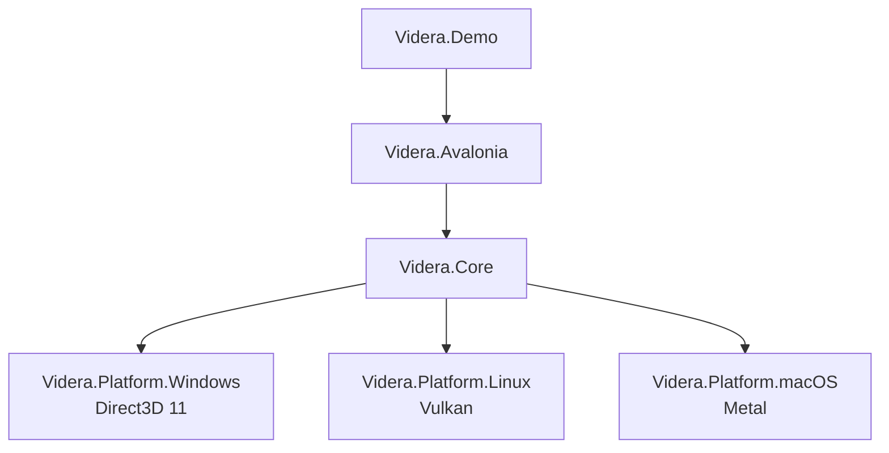

# Videra


Videra 是一套面向 .NET 桌面应用的跨平台 3D 查看组件库，核心目标是在 Avalonia 应用中提供可复用、可嵌入、可扩展的模型查看能力。

它不是通用游戏引擎，而是围绕“桌面端 3D 模型展示与交互”设计的组件化方案：统一的核心渲染逻辑，叠加各平台原生图形后端，实现一套控件在不同系统上的一致集成体验。

## 项目状态

- 当前处于早期 `alpha` 阶段
- 默认包版本线从 `0.1.0-alpha.1` 开始，而不是稳定版 `1.x`
- 在 `1.0` 之前，API、包结构和部分平台行为都可能继续调整
- 更适合评估、试用和参与共建，不应被当作稳定版组件直接承诺长期兼容性

## 项目定位

- 面向 Avalonia 桌面应用的 3D 视图组件
- 统一封装 Windows / Linux / macOS 原生 GPU 后端
- 适合模型预览、工程可视化、数字孪生前端、轻量桌面 CAD/Viewer 场景
- 提供 Demo、验证脚本和模块级文档，便于二次开发与发布

## 核心能力

- `VideraView` Avalonia 控件，可直接嵌入 XAML 界面
- 平台原生图形后端
  - Windows: Direct3D 11
  - Linux: Vulkan（当前原生路径基于 X11）
  - macOS: Metal
- 软件渲染回退路径，便于无 GPU 场景与调试
- 统一抽象层：`IGraphicsBackend`、`IResourceFactory`、`ICommandExecutor`
- 模型导入：`.gltf`、`.glb`、`.obj`
- 渲染风格预设：`Realistic`、`Tech`、`Cartoon`、`XRay`、`Clay`、`Wireframe`、`Custom`
- 线框模式：`None`、`AllEdges`、`VisibleOnly`、`Overlay`、`WireframeOnly`
- Demo 内置相机控制、网格、坐标轴、模型导入与基础变换编辑

## 架构概览



仓库按“UI 集成层 / 核心层 / 平台后端层 / 示例应用”拆分，详细说明见 [ARCHITECTURE.md](ARCHITECTURE.md)。

## 仓库结构

| 路径 | 说明 |
| --- | --- |
| [`src/Videra.Core`](src/Videra.Core/README.md) | 平台无关的渲染核心、抽象接口、模型导入与渲染风格系统 |
| [`src/Videra.Avalonia`](src/Videra.Avalonia/README.md) | Avalonia 控件封装、原生宿主接入、输入与渲染会话管理 |
| [`src/Videra.Platform.Windows`](src/Videra.Platform.Windows/README.md) | Windows Direct3D 11 后端 |
| [`src/Videra.Platform.Linux`](src/Videra.Platform.Linux/README.md) | Linux Vulkan 后端 |
| [`src/Videra.Platform.macOS`](src/Videra.Platform.macOS/README.md) | macOS Metal 后端 |
| [`samples/Videra.Demo`](samples/Videra.Demo/README.md) | 演示程序与交互参考 |
| [`docs`](docs/index.md) | 对外文档导航、故障排查、ADR 与历史归档 |

## 平台支持

| 平台 | 默认后端 | 当前状态 | 备注 |
| --- | --- | --- | --- |
| Windows 10+ | Direct3D 11 | 可用 | 仓库已覆盖真实 HWND 路径验证 |
| Linux | Vulkan | 可用 | 当前原生路径基于 X11；Wayland 暂不支持 |
| macOS 10.15+ | Metal | 可用 | 依赖 Objective-C runtime 与 `CAMetalLayer` |
| 任意平台 | Software | 回退路径 | 适合无 GPU、CI 或问题排查场景 |

## 快速开始

### 环境要求

- .NET 8 SDK
- Git
- 对应平台的图形驱动与原生依赖
  - Windows: Direct3D 11 兼容显卡
  - Linux: Vulkan 驱动、X11 运行库
  - macOS: Metal 兼容设备

### 获取源码

```bash
git clone https://github.com/ExplodingUFO/Videra.git
cd Videra
dotnet restore
dotnet build Videra.slnx
```

### 运行 Demo

```bash
dotnet run --project samples/Videra.Demo/Videra.Demo.csproj
```

### 验证仓库

```bash
# Unix shell
./verify.sh --configuration Release

# PowerShell
pwsh -File ./verify.ps1 -Configuration Release
```

如需在 Linux 或 macOS 原生宿主上执行额外验证，可使用显式开关：

```bash
./verify.sh --configuration Release --include-native-linux
./verify.sh --configuration Release --include-native-macos

pwsh -File ./verify.ps1 -Configuration Release -IncludeNativeLinux
pwsh -File ./verify.ps1 -Configuration Release -IncludeNativeMacOS
```

## 集成示例

### XAML

```xml
<Window xmlns:videra="using:Videra.Avalonia.Controls">
    <videra:VideraView
        Items="{Binding SceneObjects}"
        BackgroundColor="{Binding BackgroundColor}"
        RenderStyle="{Binding ActiveRenderStyle}"
        WireframeMode="Overlay"
        IsGridVisible="True"
        PreferredBackend="Auto" />
</Window>
```

### C#

```csharp
using Videra.Avalonia.Controls;
using Videra.Core.Graphics;

var view = new VideraView
{
    PreferredBackend = GraphicsBackendPreference.Auto,
    IsGridVisible = true
};

view.Engine.AddObject(myObject3D);
```

更多用法见 [`src/Videra.Avalonia/README.md`](src/Videra.Avalonia/README.md) 和 [`samples/Videra.Demo/README.md`](samples/Videra.Demo/README.md)。

## Demo 能力

- 导入 `.gltf`、`.glb`、`.obj`
- 轨道相机交互
  - 左键拖拽：旋转
  - 右键拖拽：平移
  - 滚轮：缩放
- 网格与坐标轴显示
- 渲染风格切换
- 线框叠加与纯线框模式
- 场景对象的基础位置、旋转、缩放调整

## 环境变量

| 变量 | 作用 | 可选值 |
| --- | --- | --- |
| `VIDERA_BACKEND` | 强制指定渲染后端 | `software`, `d3d11`, `vulkan`, `metal`, `auto` |
| `VIDERA_FRAMELOG` | 启用帧日志 | `1`, `true` |
| `VIDERA_INPUTLOG` | 启用输入日志 | `1`, `true` |

## 当前状态与限制

- 当前定位是组件库与 Viewer 能力，不是完整场景编辑器或游戏运行时
- 默认版本线使用预发布语义，当前推荐按 `0.x` / `alpha` 心智评估项目成熟度
- Linux 原生路径当前以 X11 为主，Wayland 仍是未闭合项
- Linux / macOS 的完整原生宿主闭环验证，需要在对应系统上执行显式验证开关
- macOS 后端当前通过 Objective-C runtime 互操作实现，后续仍可继续提高封装安全性

## 文档导航

- [文档首页](docs/index.md)
- [架构说明](ARCHITECTURE.md)
- [故障排查](docs/troubleshooting.md)
- [贡献指南](CONTRIBUTING.md)
- [Demo 说明](samples/Videra.Demo/README.md)
- [历史归档](docs/archive/README.md)

## 贡献

欢迎提交 Issue、文档修订或 Pull Request。开始前建议先阅读 [CONTRIBUTING.md](CONTRIBUTING.md)。

## 许可证

本项目采用 [MIT License](LICENSE.txt)。
