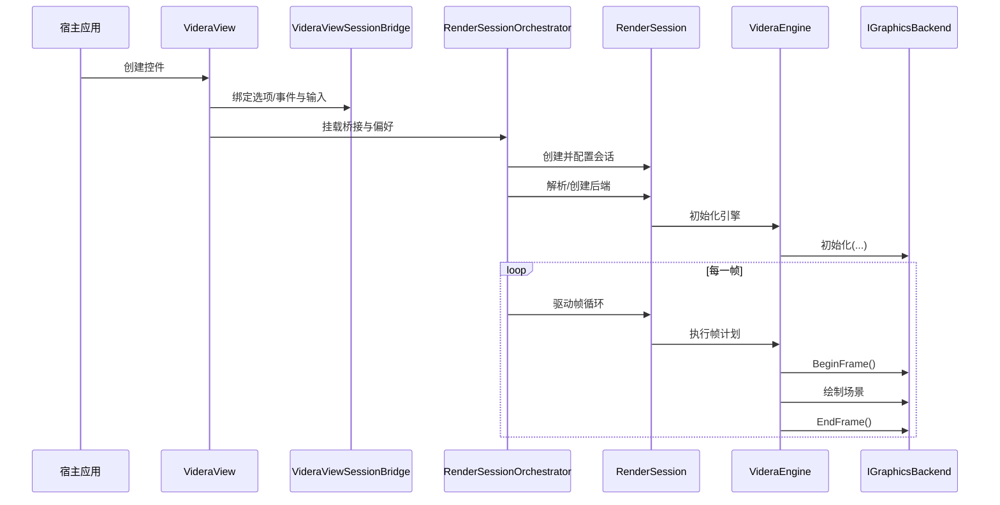

# Videra 架构说明

[English](../../ARCHITECTURE.md) | [中文](ARCHITECTURE.md)

本文档描述 Videra 的公开架构边界、模块职责和运行方式。

## 分层结构

- `Videra.Core`：平台无关的渲染核心、抽象接口、导入与软件回退；`VideraEngine` 负责构建帧计划并执行管线
- `Videra.Avalonia`：Avalonia 控件层、渲染会话与原生宿主桥接；包含
  - 主机无关的会话编排入口 `RenderSessionOrchestrator`
  - 运行时/呈现适配器宿主 `RenderSession`
  - 视图事件与选项同步桥 `VideraViewSessionBridge`
- `Videra.Platform.Windows`：Direct3D 11 后端
- `Videra.Platform.Linux`：Vulkan 后端
- `Videra.Platform.macOS`：Metal 后端
- `Videra.Demo`：示例应用

### 边界职责

- `VideraEngine` 拥有帧计划与管线执行能力。
- `RenderSessionOrchestrator` 负责跨平台无关的会话编排（会话创建、绑定、驱动渲染时序）。
- `RenderSession` 承载 Avalonia 专用的运行时/呈现适配器生命周期。
- `VideraViewSessionBridge` 将 `VideraView` 的输入、事件与配置翻译为会话同步更新。
- `VideraView` 仍然是 UI 壳和原生宿主/输入表面，不直接承担核心渲染调度。



## 渲染流水线约定

Phase 11 保持这条边界：`VideraEngine` 在 Core 中持有帧计划与执行语义，`RenderSessionOrchestrator` 与 `RenderSession` 负责何时驱动帧。

当前已经对外开放一组收窄后的扩展接口：

- `IRenderPassContributor`
- `RegisterPassContributor(...)`
- `ReplacePassContributor(...)`
- `RegisterFrameHook(...)`
- `RenderFrameHookPoint`
- `GetRenderCapabilities()`
- `VideraView.RenderCapabilities`

如需可复制的开发者入口，先看 [扩展合同](extensibility.md) 与 `samples/Videra.ExtensibilitySample`。该合同页固定了 `RegisterPassContributor(...)` / `RegisterFrameHook(...)` 的公开调用顺序，并明确以下运行时语义：

- `disposed` 后追加的 `RegisterPassContributor(...)`、`ReplacePassContributor(...)` 与 `RegisterFrameHook(...)` 调用继续保持 `no-op`
- `RenderCapabilities` / `GetRenderCapabilities()` 仍可查询，但会回到未初始化快照
- `BackendDiagnostics` 与 `FallbackReason` 负责说明 native unavailable 时是进入 software fallback，还是因为关闭回退而保持失败态

边界说明：

- `VideraEngine` 是 public extensibility root。
- `VideraView.BackendDiagnostics` 继续负责后端/运行时诊断真相。
- `RenderSessionOrchestrator`、`RenderSession`、`RenderSessionSnapshot`、`VideraViewSessionBridge` 仍然是 internal boundary，不应被外部当成扩展根使用。
- 当前仍不包含 `package discovery`、`plugin loading` 或超出 `samples/Videra.ExtensibilitySample` 的完整插件式 sample onboarding。

## 后端选择

Videra 支持两条后端选择路径：

1. `VideraView.PreferredBackend`
2. `VIDERA_BACKEND` 环境变量

`Auto` 默认按平台选择：

- Windows: `D3D11`
- Linux: `Vulkan`
- macOS: `Metal`

## 验证策略

标准验证入口：

```bash
./verify.sh --configuration Release
pwsh -File ./scripts/verify.ps1 -Configuration Release
```

Linux 和 macOS 的原生宿主闭环验证需要显式启用：

```bash
./verify.sh --configuration Release --include-native-linux
./verify.sh --configuration Release --include-native-macos

pwsh -File ./scripts/verify.ps1 -Configuration Release -IncludeNativeLinux
pwsh -File ./scripts/verify.ps1 -Configuration Release -IncludeNativeMacOS
```

## 相关文档

- [英文架构文档](../../ARCHITECTURE.md)
- [中文文档导航](index.md)
- [故障排查](troubleshooting.md)
