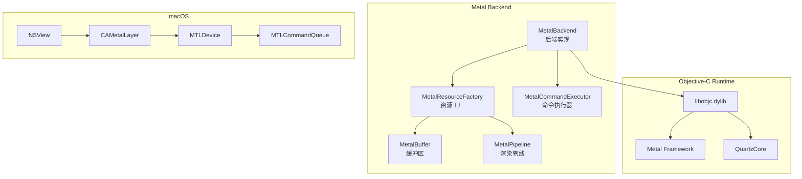
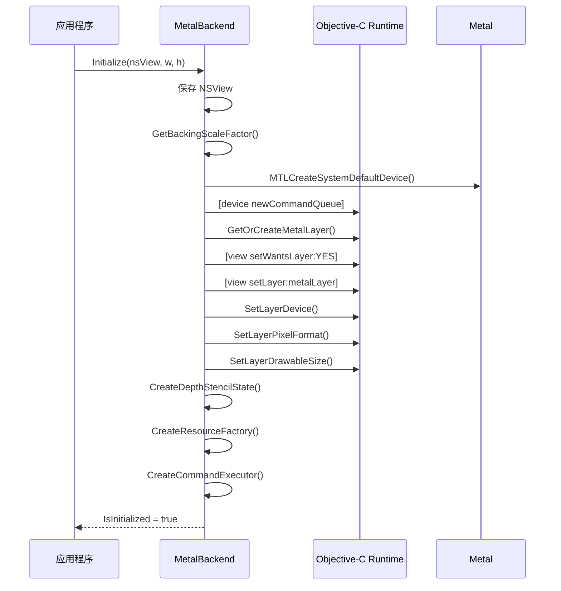
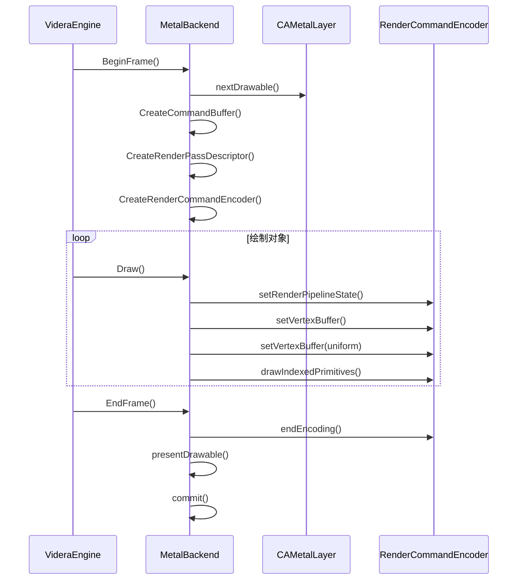
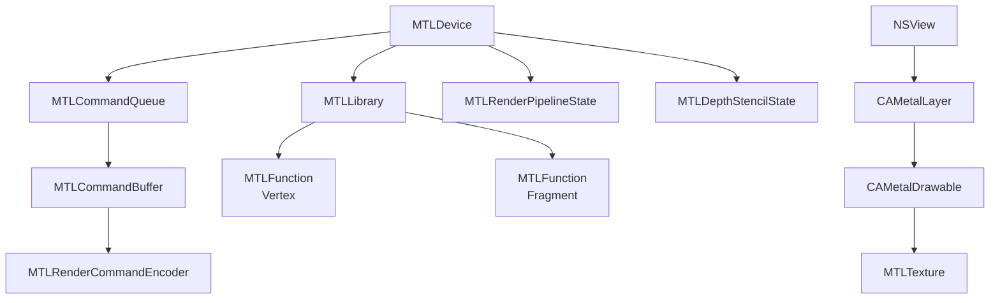
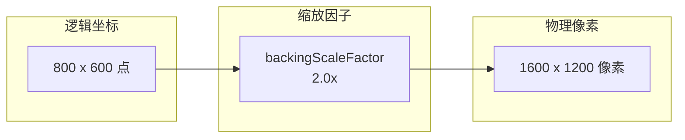

# Videra.Platform.macOS - Metal 后端

[English](../../../src/Videra.Platform.macOS/README.md) | [中文](platform-macos.md)

macOS 平台的 Metal 图形后端实现。

> 中文镜像用于快速查阅，英文版为准。

## 安装前置

公开消费者默认从 `nuget.org` 安装：

```bash
dotnet add package Videra.Avalonia
dotnet add package Videra.Platform.macOS
```

当前 `alpha` 的 `preview` 验证仍可使用 `GitHub Packages`，但那不是默认公开安装路径：

```bash
dotnet nuget add source "https://nuget.pkg.github.com/ExplodingUFO/index.json" \
  --name github-ExplodingUFO \
  --username YOUR_GITHUB_USER \
  --password YOUR_GITHUB_PAT \
  --store-password-in-clear-text

dotnet add package Videra.Avalonia --version 0.1.0-alpha.5 --source github-ExplodingUFO
dotnet add package Videra.Platform.macOS --version 0.1.0-alpha.5 --source github-ExplodingUFO
```

当前原生路径依赖 `NSView` 和 `CAMetalLayer`，matching-host 原生验证仍需要真实 macOS 宿主。

## 模块架构



## Metal 初始化流程



## 渲染流程



## Metal 对象层次



## Retina 显示支持



- 自动检测 `backingScaleFactor`
- 设置 `contentsScale` 匹配缩放因子
- `drawableSize` 使用物理像素尺寸

## 核心类

### MetalBackend

实现 `IGraphicsBackend` 接口的 Metal 后端。

```csharp
public class MetalBackend : IGraphicsBackend
{
    public void Initialize(IntPtr windowHandle, int width, int height);
    public void Resize(int width, int height);
    public void BeginFrame();
    public void EndFrame();
    public void SetClearColor(Vector4 color);
    public IResourceFactory GetResourceFactory();
    public ICommandExecutor GetCommandExecutor();
}
```

## Objective-C 互操作

通过 P/Invoke 调用 Objective-C Runtime：

```csharp
[DllImport("/usr/lib/libobjc.dylib")]
static extern IntPtr objc_getClass(string name);

[DllImport("/usr/lib/libobjc.dylib")]
static extern IntPtr sel_registerName(string name);

[DllImport("/usr/lib/libobjc.dylib")]
static extern IntPtr objc_msgSend(IntPtr receiver, IntPtr selector);
```

## 深度缓冲配置

- 深度格式: `MTLPixelFormatDepth32Float`
- 比较函数: `MTLCompareFunctionLessEqual`
- 深度写入: 启用
- 深度范围: [0, 1] (Metal 约定)

## 文件结构

```
Videra.Platform.macOS/
├── MetalBackend.cs           # 后端实现
├── MetalBuffer.cs            # 缓冲区实现
├── MetalCommandExecutor.cs   # 命令执行器
├── MetalPipeline.cs          # 渲染管线
└── MetalResourceFactory.cs   # 资源工厂
```

## 依赖

- .NET 8.0
- Videra.Core
- macOS 系���框架 (通过 P/Invoke)

## 系统要求

- macOS 10.15 (Catalina) 或更高版本
- Metal 兼容显卡
- 支持 Apple Silicon (M1/M2/M3) 和 Intel Mac

## 原生验证

在 macOS 原生主机上，可通过仓库统一验证入口执行 Metal 原生验证包：

```bash
# Unix shell
./scripts/verify.sh --configuration Release --include-native-macos

# PowerShell
pwsh -File ./scripts/verify.ps1 -Configuration Release -IncludeNativeMacOS
```

这一步用于执行 `tests/Videra.Platform.macOS.Tests` 中的真实 NSView-backed lifecycle/render-path 验证，而不仅仅是当前非 macOS 主机上的构建级验证。

