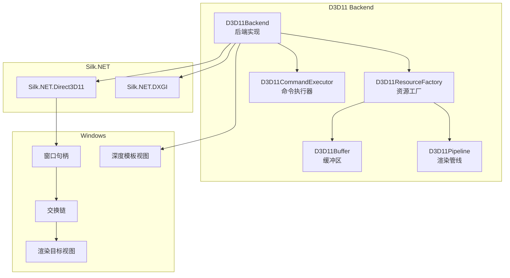
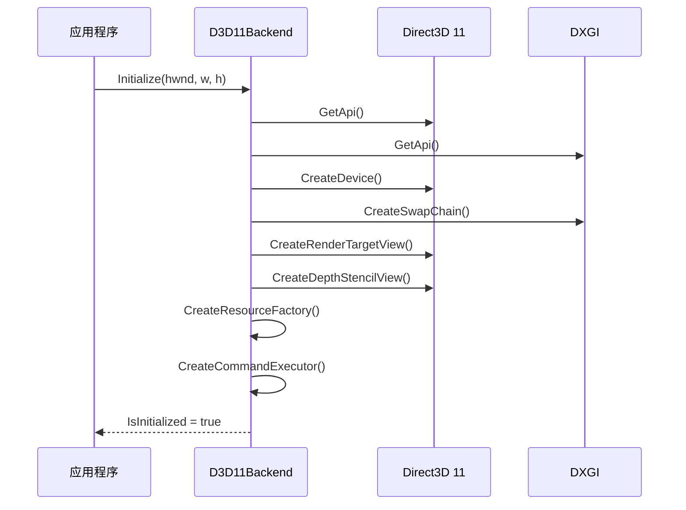
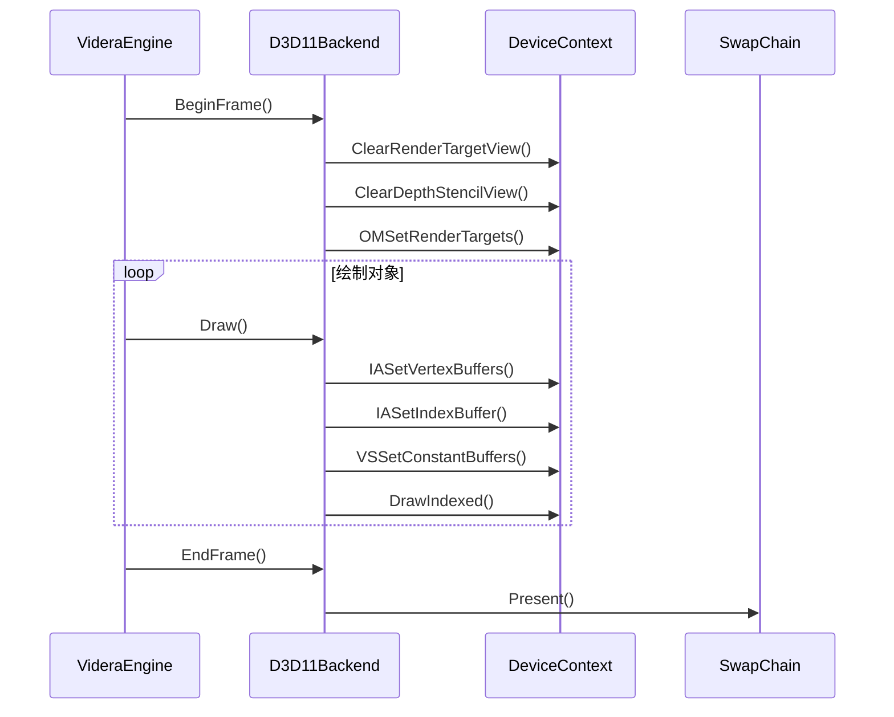
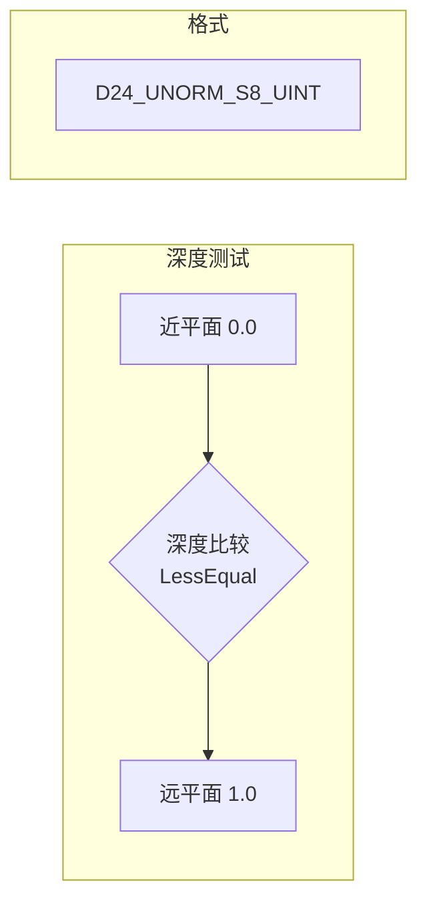

# Videra.Platform.Windows - Direct3D 11 后端

[English](../../../src/Videra.Platform.Windows/README.md) | [中文](platform-windows.md)

Windows 平台的 Direct3D 11 图形后端实现。

> 中文镜像用于快速查阅，英文版为准。

## 安装前置

公开消费者默认从 `nuget.org` 安装：

```bash
dotnet add package Videra.Avalonia
dotnet add package Videra.Platform.Windows
```

当前 `alpha` 的 `preview` 验证仍可使用 `GitHub Packages`，但那不是默认公开安装路径：

```bash
dotnet nuget add source "https://nuget.pkg.github.com/ExplodingUFO/index.json" \
  --name github-ExplodingUFO \
  --username YOUR_GITHUB_USER \
  --password YOUR_GITHUB_PAT \
  --store-password-in-clear-text

dotnet add package Videra.Avalonia --version 0.1.0-alpha.4 --source github-ExplodingUFO
dotnet add package Videra.Platform.Windows --version 0.1.0-alpha.4 --source github-ExplodingUFO
```

Windows matching-host validation 已经纳入标准仓库验证与 GitHub Actions。

## 模块架构



## 初始化流程



## 渲染流程



## 核心类

### D3D11Backend

实现 `IGraphicsBackend` 接口的 Direct3D 11 后端。

```csharp
public class D3D11Backend : IGraphicsBackend
{
    public void Initialize(IntPtr windowHandle, int width, int height);
    public void Resize(int width, int height);
    public void BeginFrame();
    public void EndFrame();
    public void SetClearColor(Vector4 color);
    public IResourceFactory GetResourceFactory();
    public ICommandExecutor GetCommandExecutor();
}
```

### D3D11ResourceFactory

创建 D3D11 GPU 资源。

```csharp
internal class D3D11ResourceFactory : IResourceFactory
{
    public IBuffer CreateVertexBuffer(VertexPositionNormalColor[] vertices);
    public IBuffer CreateVertexBuffer(uint sizeInBytes);
    public IBuffer CreateIndexBuffer(uint[] indices);
    public IBuffer CreateIndexBuffer(uint sizeInBytes);
    public IBuffer CreateUniformBuffer(uint sizeInBytes);
    public IPipeline CreatePipeline(PipelineDescription description);
    public IPipeline CreatePipeline(uint vertexSize, bool hasNormals, bool hasColors);
}
```

## 深度缓冲配置



- 深度格式: `D24_UNORM_S8_UINT`
- 比较函数: `LessEqual`
- 深度写入: 启用

## 文件结构

```
Videra.Platform.Windows/
├── D3D11Backend.cs           # 后端实现
├── D3D11Buffer.cs            # 缓冲区实现
├── D3D11CommandExecutor.cs   # 命令执行器
├── D3D11Pipeline.cs          # 渲染管线
└── D3D11ResourceFactory.cs   # 资源工厂
```

## 依赖

- .NET 8.0
- Silk.NET.Direct3D11
- Silk.NET.DXGI
- Videra.Core

## 原生验证

在 Windows 原生主机上，可通过仓库统一验证入口执行 D3D11 与真实 HWND 生命周期验证：

```bash
# Unix shell
./scripts/verify.sh --configuration Release

# PowerShell
pwsh -File ./scripts/verify.ps1 -Configuration Release
```

这一步会覆盖解决方案构建、测试以及 `tests/Videra.Platform.Windows.Tests` 中的真实 HWND-backed D3D11 验证路径。

## 系统要求

- Windows 10 或更高版本
- Direct3D 11 兼容显卡
- 支持 Feature Level 11_0

