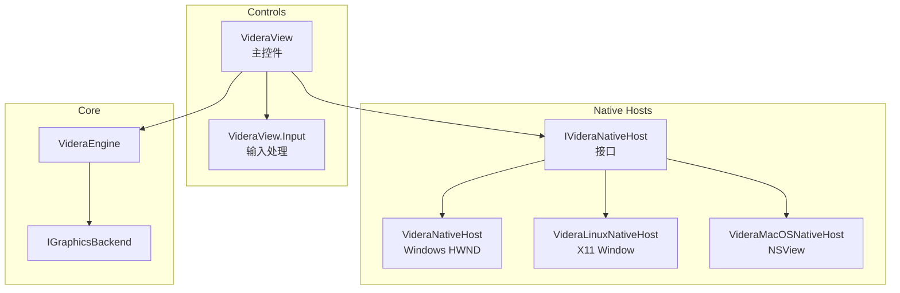
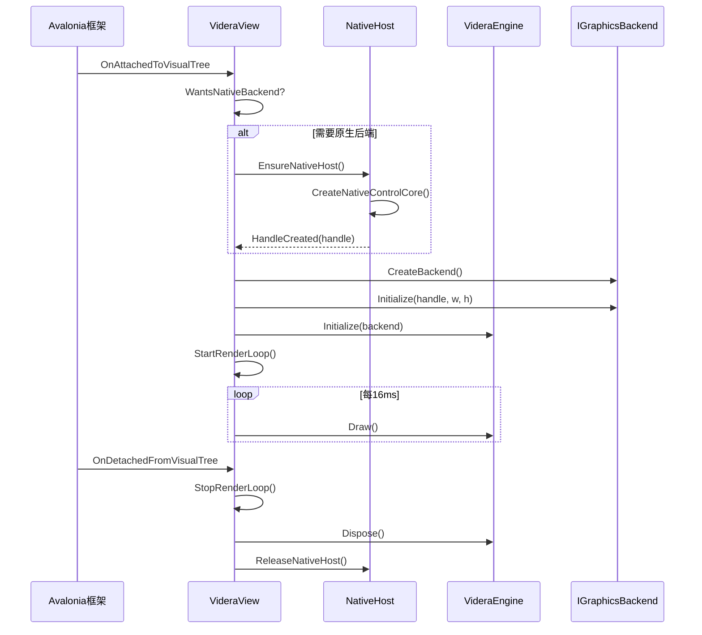
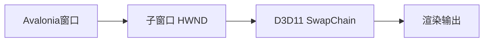
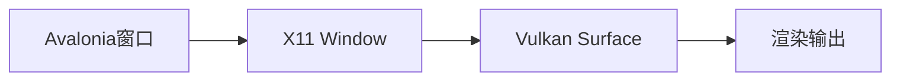
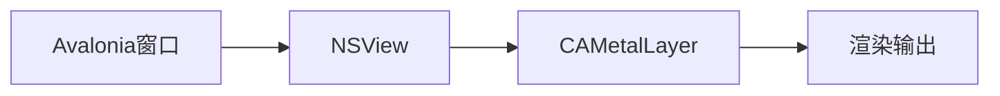
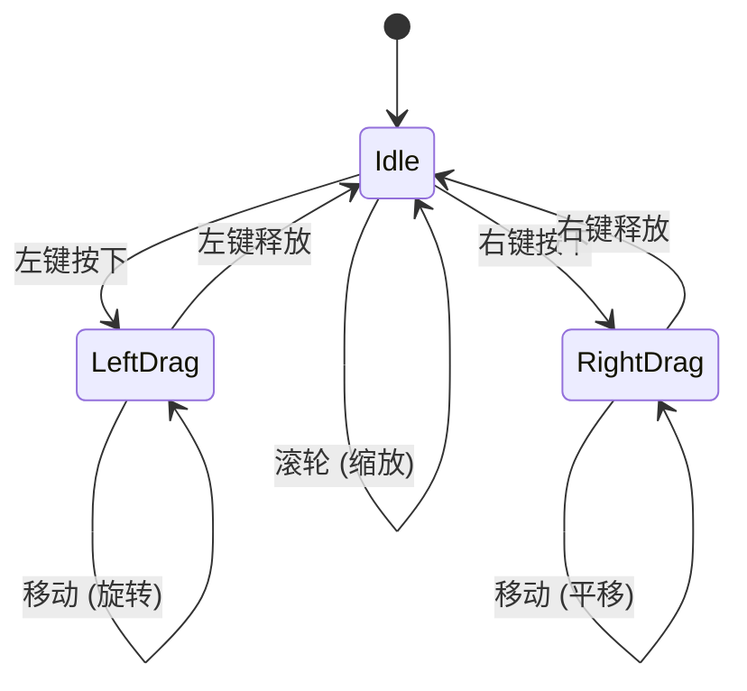

# Videra.Avalonia - AvaloniaUI 集成模块

[English](../../../src/Videra.Avalonia/README.md) | [中文](videra-avalonia.md)

提供 AvaloniaUI 控件集成，包括 `VideraView` 控件和平台原生窗口宿主。

> 中文镜像用于快速查阅，英文版为准。

## 安装

公开消费者默认从 `nuget.org` 安装。Avalonia 应用请安装入口包和一个匹配平台包：

```bash
dotnet add package Videra.Avalonia
dotnet add package Videra.Platform.Windows
# 或
dotnet add package Videra.Platform.Linux
# 或
dotnet add package Videra.Platform.macOS
```

当前 `alpha` 的 `preview` 验证仍可使用 `GitHub Packages`，但那不是默认公开安装路径：

```bash
dotnet nuget add source "https://nuget.pkg.github.com/ExplodingUFO/index.json" \
  --name github-ExplodingUFO \
  --username YOUR_GITHUB_USER \
  --password YOUR_GITHUB_PAT \
  --store-password-in-clear-text

dotnet add package Videra.Avalonia --version 0.1.0-alpha.2 --source github-ExplodingUFO
dotnet add package Videra.Platform.Windows --version 0.1.0-alpha.2 --source github-ExplodingUFO
```

`PreferredBackend` 和 `VIDERA_BACKEND` 只影响后端偏好，不会安装缺失的平台包，也不会替代 matching-host 原生验证。

## 模块架构



## VideraView 控件

主要的3D视图控件，继承自 `Decorator`。

### 属性

| 属性 | 类型 | 说明 |
|------|------|------|
| BackgroundColor | Color | 背景颜色 |
| Items | IEnumerable | 3D对象集合 |
| CameraInvertX | bool | 相机X轴反转 |
| CameraInvertY | bool | 相机Y轴反转 |
| IsGridVisible | bool | 显示网格 |
| GridHeight | float | 网格高度 |
| GridColor | Color | 网格颜色 |
| PreferredBackend | GraphicsBackendPreference | 首选后端 |

### 扩展与查询入口

- `VideraView.Engine`：public extensibility root，可调用 `RegisterPassContributor(...)`、`ReplacePassContributor(...)`、`RegisterFrameHook(...)`
- `VideraView.RenderCapabilities`：公开的 Core capability snapshot
- `VideraView.BackendDiagnostics`：公开的 backend/runtime diagnostics shell

扩展入口的完整中文镜像见 [扩展合同](../extensibility.md)。建议直接对照 `samples/Videra.ExtensibilitySample`，按以下公开流程接入：

- 配置后端偏好与 `AllowSoftwareFallback`
- 通过 `VideraView.Engine` 调用 `RegisterPassContributor(...)`
- 通过 `VideraView.Engine` 调用 `RegisterFrameHook(...)`
- 等待 `BackendDiagnostics.IsReady` 或 `BackendReady`
- 调用 `LoadModelAsync(...)`、`FrameAll()`，然后检查 `RenderCapabilities`、`BackendDiagnostics` 与 `FallbackReason`

`LoadModelsAsync(...)` 现在使用有界并发导入，并且只有在全部导入成功时才替换 active scene；部分成功只会通过 `ModelLoadBatchResult` 报告，不会污染当前场景。

合同语义保持与英文版一致：`disposed` 后的新注册调用保持 `no-op`；若 native backend unavailable 且允许回退，则 `BackendDiagnostics` / `FallbackReason` 说明 software fallback；`package discovery` 与 `plugin loading` 仍不在公开范围内。`SceneDocument` 继续作为 internal scene truth，让 backend rebind 时可以恢复场景资源，而不是依赖 steady-state software staging path。

### 受控交互合同

`host owns` `SelectionState`、`Annotations` 与 annotation state。

`VideraView` 还提供受控交互入口。推荐直接对照 `samples/Videra.InteractionSample`：

- 内建模式：`Navigate`、`Select`、`Annotate`
- `SelectionRequested` 只报告选择意图，host 决定如何更新 `SelectionState`
- `AnnotationRequested` 可返回 object anchors 或 world-point anchors，然后由 host 创建 `VideraNodeAnnotation` 或 `VideraWorldPointAnnotation`
- selection 保持 `object-level`
- overlay responsibilities split between `3D highlight/render state` and `2D label/feedback rendering`

这条合同强调 public flow，而不是内部 seam。也就是说，示例只通过 `View3D.SelectionState`、`View3D.Annotations`、`View3D.InteractionMode`、`SelectionRequested`、`AnnotationRequested` 往返状态，不直接接触内部 overlay 类型。

### 使用示例

```xml
<controls:VideraView Name="View3D"
                     Items="{Binding SceneObjects}"
                     BackgroundColor="{Binding BgColor}"
                     CameraInvertX="{Binding Camera.InvertX}"
                     CameraInvertY="{Binding Camera.InvertY}"
                     IsGridVisible="{Binding IsGridVisible}"
                     GridHeight="{Binding GridHeight}"
                     GridColor="{Binding GridColor}"/>
```

## 控件生命周期



## 平台原生宿主

### Windows (VideraNativeHost)

使用 Win32 API 创建子窗口 (HWND) 用于 Direct3D 渲染。



特点：
- 创建子窗口作为渲染目标
- 钩子 WndProc 拦截鼠标消息
- 支持 DPI 缩放

### Linux (VideraLinuxNativeHost)

使用 X11 API 创建窗口用于 Vulkan 渲染。



特点：
- 通过 libX11 创建 X11 窗口（支持仓库级 fallback 解析）
- 重新父化到 Avalonia 窗口
- 支持窗口大小调整

### macOS (VideraMacOSNativeHost)

使用 Objective-C Runtime 创建 NSView 用于 Metal 渲染。



特点：
- 通过 libobjc.dylib 创建 NSView
- 启用 layer-backed 视图
- 支持 Retina 显示

## 输入处理



### 输入来源

1. **Avalonia 指针事件** - 用于软件渲染模式
2. **原生窗口消息** - 用于 Windows 原生渲染
3. **TopLevel 事件** - 用于跨平台兼容

## 文件结构

```
Videra.Avalonia/
├── Controls/
│   ├── IVideraNativeHost.cs        # 原生宿主接口
│   ├── NativePointerEvent.cs       # 原生指针事件
│   ├── VideraNativeHost.cs         # Windows 宿主
│   ├── VideraLinuxNativeHost.cs    # Linux 宿主
│   ├── VideraMacOSNativeHost.cs    # macOS 宿主
│   ├── VideraView.cs               # 主控件
│   └── VideraView.Input.cs         # 输入处理
└── Interop/
    └── Win32.cs                    # Win32 API 声明
```

## 依赖

- .NET 8.0
- Avalonia 11.x
- Videra.Core
