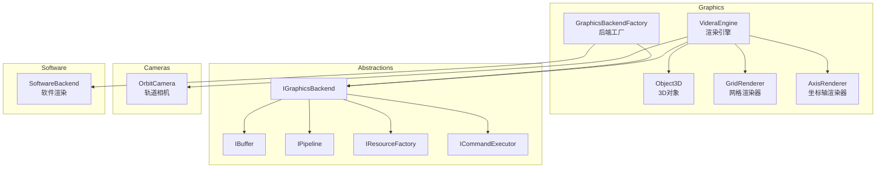
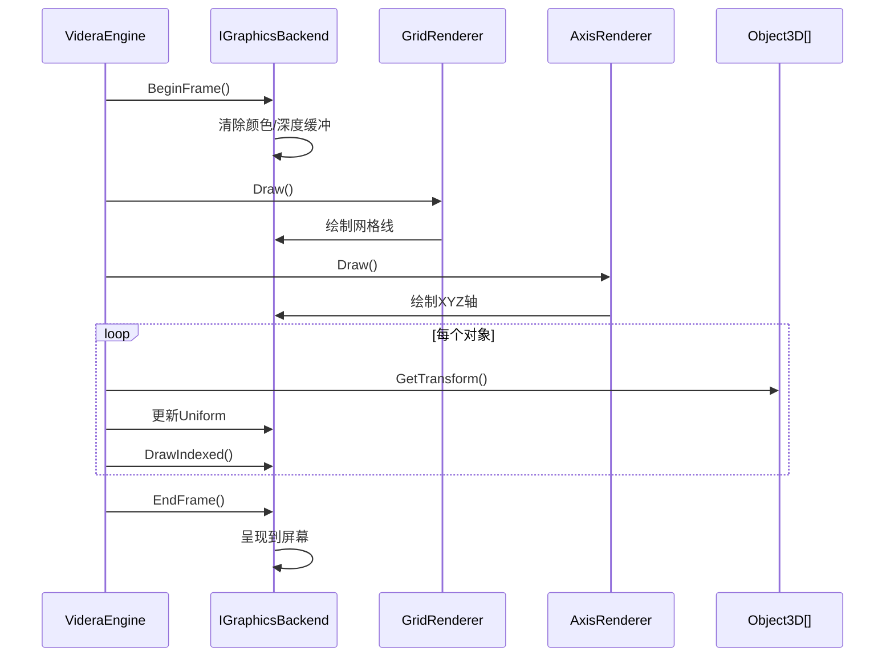
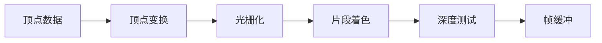

# Videra.Core - 核心渲染模块

[English](../../../src/Videra.Core/README.md) | [中文](videra-core.md)

平台无关的3D渲染核心，提供抽象接口和通用渲染逻辑。

> 中文镜像用于快速查阅，英文版为准。

## 安装前置

公开消费者默认从 `nuget.org` 安装：

```bash
dotnet add package Videra.Core
```

只在需要运行时内核和核心渲染抽象时直接安装。桌面 UI 集成更推荐从 `Videra.Avalonia` 加匹配平台包开始；如果还需要文件导入能力，再额外安装 `Videra.Import.Gltf` 或 `Videra.Import.Obj`。

当前 `alpha` 的 `preview` 验证仍可使用 `GitHub Packages`，但那不是默认公开安装路径：

```bash
dotnet nuget add source "https://nuget.pkg.github.com/ExplodingUFO/index.json" \
  --name github-ExplodingUFO \
  --username YOUR_GITHUB_USER \
  --password YOUR_GITHUB_PAT \
  --store-password-in-clear-text

dotnet add package Videra.Core --version 0.1.0-alpha.7 --source github-ExplodingUFO
```

## 模块架构



## 核心类说明

### VideraEngine

渲染引擎核心，管理场景对象、相机和渲染循环。

```csharp
public class VideraEngine : IDisposable
{
    public OrbitCamera Camera { get; }
    public GridRenderer Grid { get; }
    public WireframeRenderer Wireframe { get; }
    public bool ShowAxis { get; set; }
    public bool IsInitialized { get; }

    public void Initialize(IGraphicsBackend backend);
    public void Resize(uint width, uint height);
    public void AddObject(Object3D obj);
    public void RemoveObject(Object3D obj);
    public void Draw();
}
```

### Object3D

表示场景中的 3D 对象，包含独立的位置 / 旋转 / 缩放变换，以及运行时创建的 GPU 缓冲区资源。

```csharp
public class Object3D : IDisposable
{
    public string Name { get; set; }
    public Vector3 Position { get; set; }
    public Vector3 Rotation { get; set; }
    public Vector3 Scale { get; set; }
    public Matrix4x4 WorldMatrix { get; }

    public void Initialize(IResourceFactory factory, MeshData mesh, ILogger? logger = null);
    public void UpdateUniforms(ICommandExecutor executor);
    public void Dispose();
}
```

## 渲染流程



当前实现已经把一帧的稳定 stage vocabulary 显式化，并由 `VideraEngine.LastPipelineSnapshot` 记录最近一帧的真实执行结果。

稳定 stage vocabulary：

- `PrepareFrame`
- `BindSharedFrameState`
- `GridPass`
- `SolidGeometryPass`
- `WireframePass`
- `AxisPass`
- `PresentFrame`

合同边界：

- `RenderPipelineProfile` 表示当前帧的 profile，当前值为 `Standard`、`StandardWithWireframeOverlay`、`WireframeOnly`。
- `LastFrameStageNames` 镜像最近一帧真正执行过的 stage 名称。
- `UsesSoftwarePresentationCopy` 用来区分当前是否经过软件位图拷贝呈现。

Phase 11 新增的 public extensibility contract：

- `IRenderPassContributor`
- `RegisterPassContributor(...)`
- `ReplacePassContributor(...)`
- `RegisterFrameHook(...)`
- `RenderFrameHookPoint`
- `GetRenderCapabilities()`

当前边界：

- `VideraEngine` 是 public extensibility root。
- 这套 API 是 C#-first、进程内的 contract，不包含 package discovery 或 plugin loading。
- Avalonia 的 internal session/orchestration 类型不是对外扩展入口。
- `SceneDocument` 保留 imported asset 的 backend-neutral 真相，backend 恢复会从这份 scene truth 重建资源，而不是长期依赖 software staging path；当前 shipped runtime 仍是 static-scene-only，动画、骨骼、morph targets、灯光和阴影都不在这条 baseline 内。

开发者入口请直接配合 [扩展合同](../extensibility.md) 阅读，并以 `samples/Videra.ExtensibilitySample` 作为最小参考流程：

- 先从 `VideraView.Engine` 或 Core 等效入口调用 `RegisterPassContributor(...)`
- 再通过 `RegisterFrameHook(...)` 绑定 `FrameBegin` / `SceneSubmit` / `FrameEnd`
- 用 `GetRenderCapabilities()` / `RenderCapabilities` 与 `BackendDiagnostics` 读取当前 capability 与后端状态
- 当前 `disposed` 后的追加注册继续是 `no-op`；`package discovery` 与 `plugin loading` 仍然不在这条公开 contract 内

## 抽象接口

### IGraphicsBackend

图形后端抽象接口，各平台需实现此接口。

```csharp
public interface IGraphicsBackend : IDisposable
{
    bool IsInitialized { get; }
    void Initialize(IntPtr windowHandle, int width, int height);
    void Resize(int width, int height);
    void BeginFrame();
    void EndFrame();
    void SetClearColor(Vector4 color);
    IResourceFactory GetResourceFactory();
    ICommandExecutor GetCommandExecutor();
}
```

### IResourceFactory

资源创建工厂接口。

```csharp
public interface IResourceFactory
{
    IBuffer CreateVertexBuffer(VertexPositionNormalColor[] vertices);
    IBuffer CreateVertexBuffer(uint sizeInBytes);
    IBuffer CreateIndexBuffer(uint[] indices);
    IBuffer CreateIndexBuffer(uint sizeInBytes);
    IBuffer CreateUniformBuffer(uint sizeInBytes);
    IPipeline CreatePipeline(PipelineDescription description);
    IPipeline CreatePipeline(uint vertexSize, bool hasNormals, bool hasColors);
    IShader CreateShader(ShaderStage stage, byte[] bytecode, string entryPoint);
    IResourceSet CreateResourceSet(ResourceSetDescription description);
}
```

## 软件渲染

当硬件加速不可用时，自动回退到CPU软件渲染。



## 文件结构

```
Videra.Core/
├── Cameras/
│   └── OrbitCamera.cs          # 轨道相机
├── Geometry/
│   └── VertexPositionNormalColor.cs  # 顶点结构
├── Graphics/
│   ├── Abstractions/           # 抽象接口
│   │   ├── IBuffer.cs
│   │   ├── ICommandExecutor.cs
│   │   ├── IGraphicsBackend.cs
│   │   ├── IPipeline.cs
│   │   ├── IResourceFactory.cs
│   │   └── ISoftwareBackend.cs
│   ├── Software/               # 软件渲染实现
│   │   ├── SoftwareBackend.cs
│   │   ├── SoftwareBuffer.cs
│   │   └── ...
│   ├── AxisRenderer.cs
│   ├── CameraUniform.cs
│   ├── GraphicsBackendFactory.cs
│   ├── GridRenderer.cs
│   ├── Object3D.cs
│   └── VideraEngine.cs
└── IO/
    └── ModelImporter.cs        # 模型导入
```

## 验证流程

在仓库根目录使用统一验证入口：

```bash
# Unix shell
./scripts/verify.sh --configuration Release

# PowerShell
pwsh -File ./scripts/verify.ps1 -Configuration Release
```

如需仅执行 Core 相关测试，可直接运行：

```bash
dotnet test tests/Videra.Core.Tests/Videra.Core.Tests.csproj -c Release
dotnet test tests/Videra.Core.IntegrationTests/Videra.Core.IntegrationTests.csproj -c Release
```

## 依赖

- .NET 8.0
- System.Numerics.Vectors
- SharpGLTF.Core (模型导入)

