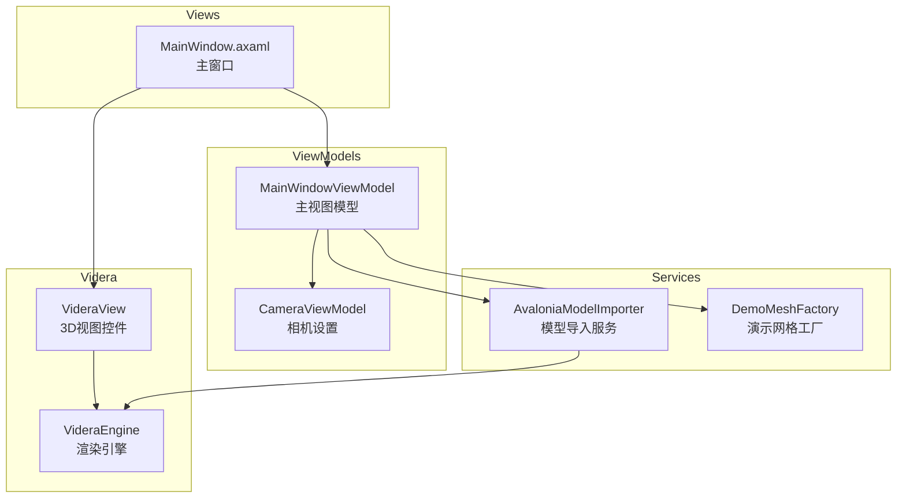
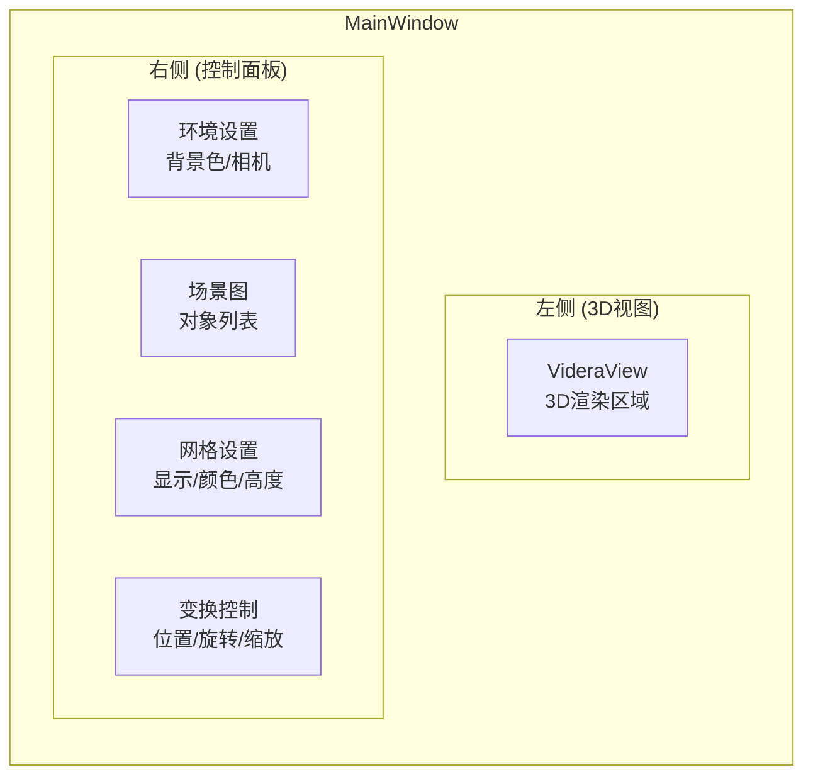
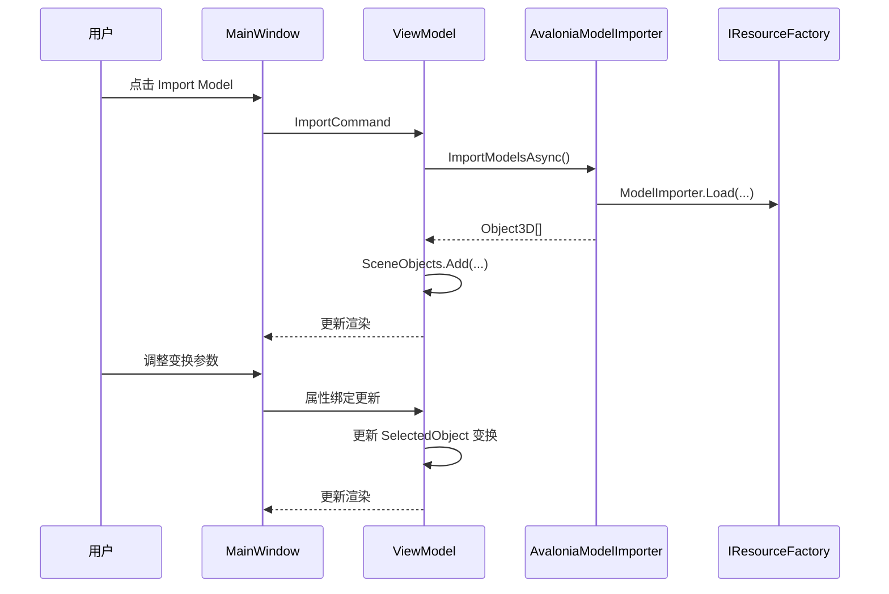
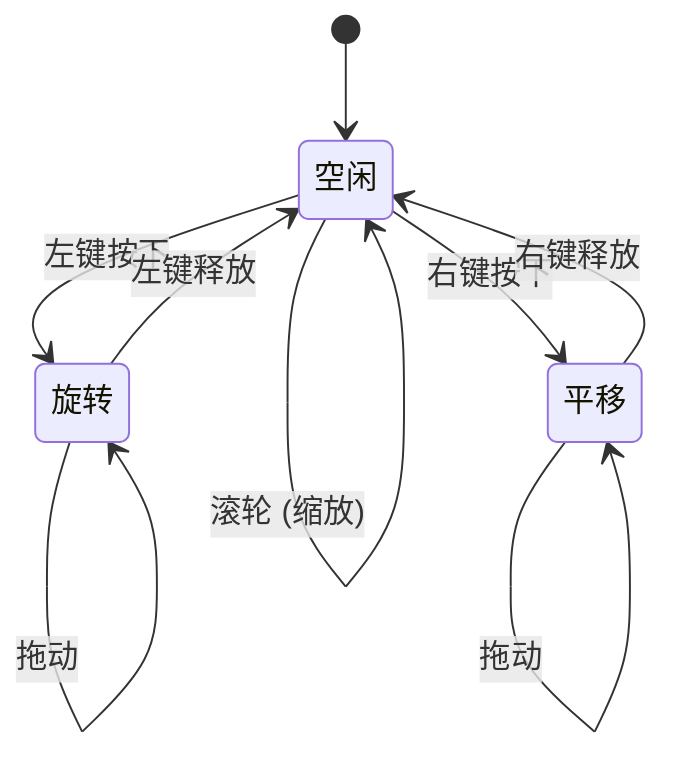

# Videra.Demo - 示例应用程序

基于 Avalonia MVVM 模式的 3D 模型查看器示例应用。

## 应用架构



## 界面布局



## 数据流



## 功能特性

### 环境设置
- 背景颜色选择
- 相机X/Y轴反转

### 场景管理
- 导入 3D 模型 (GLTF/GLB/OBJ)
- 默认加载演示立方体
- 对象列表显示
- 对象选择

### 网格辅助
- 显示/隐藏网格
- 网格高度调整
- 网格颜色设置

### 变换控制
- 位置 (X, Y, Z)
- 旋转 (X, Y, Z)
- 缩放 (统一)

## 鼠标控制



| 操作 | 功能 |
|------|------|
| 左键拖拽 | 旋转视角 |
| 右键拖拽 | 平移视角 |
| 滚轮 | 缩放视角 |

## 运行方式

默认情况下，Demo 会在启动后等待 `VideraView` 后端准备完成，再初始化导入服务，并尝试加载一个默认演示立方体。`MainWindow.axaml` 现在将 `PreferredBackend` 设为 `Auto`，因此会按当前平台优先选择原生后端：Windows 为 D3D11，Linux 为 Vulkan，macOS 为 Metal。Windows 启动入口仍会显式设置 `VIDERA_BACKEND=d3d11`，用于稳定验证 Windows 原生路径。

### Windows
```bash
cd samples/Videra.Demo
dotnet run
```

### Linux
```bash
cd samples/Videra.Demo
dotnet run
```

### macOS
```bash
cd samples/Videra.Demo
dotnet run
```

## 文件结构

```
Videra.Demo/
├── Assets/
│   └── avalonia-logo.ico       # 应用图标
├── Converters/
│   └── ObjectConverters.cs     # 值转换器
├── Services/
│   ├── AvaloniaModelImporter.cs  # 模型导入
│   └── DemoMeshFactory.cs        # 演示网格
├── ViewModels/
│   ├── CameraViewModel.cs        # 相机VM
│   └── MainWindowViewModel.cs    # 主VM
├── Views/
│   ├── MainWindow.axaml          # 主窗口XAML
│   └── MainWindow.axaml.cs       # 主窗口代码
├── App.axaml                     # 应用定义
├── App.axaml.cs                  # 应用代码
└── Program.cs                    # 入口点
```

## MVVM 绑定示例

### XAML
```xml
<controls:VideraView Name="View3D"
                     Items="{Binding SceneObjects}"
                     BackgroundColor="{Binding BgColor}"
                     CameraInvertX="{Binding Camera.InvertX}"
                     CameraInvertY="{Binding Camera.InvertY}"
                     RenderStyle="{Binding RenderStyle}"
                     WireframeMode="{Binding WireframeMode}"
                     WireframeColor="{Binding WireframeColor}"
                     IsGridVisible="{Binding IsGridVisible}"
                     GridHeight="{Binding GridHeight}"
                     GridColor="{Binding GridColor}"
                     PreferredBackend="Auto"/>
```

### ViewModel
```csharp
public class MainWindowViewModel : ViewModelBase
{
    public ObservableCollection<Object3D> SceneObjects { get; }
    public Color BgColor { get; set; }
    public CameraViewModel Camera { get; }
    public RenderStylePreset RenderStyle { get; set; }
    public WireframeMode WireframeMode { get; set; }
    public Color WireframeColor { get; set; }
    public bool IsGridVisible { get; set; }
    public decimal GridHeight { get; set; }
    public Color GridColor { get; set; }
    public string StatusMessage { get; set; }
    public string BackendDisplay { get; set; }
    public IAsyncRelayCommand ImportCommand { get; }
}
```

## 验证流程

在仓库根目录使用统一验证入口：

```bash
# Unix shell
./verify.sh --configuration Release

# PowerShell
pwsh -File ./verify.ps1 -Configuration Release
```

如需仅验证 Demo 项目：

```bash
dotnet build samples/Videra.Demo/Videra.Demo.csproj -c Release
```

## 依赖

- .NET 8.0
- Avalonia 11.x
- Videra.Avalonia
- Videra.Core
