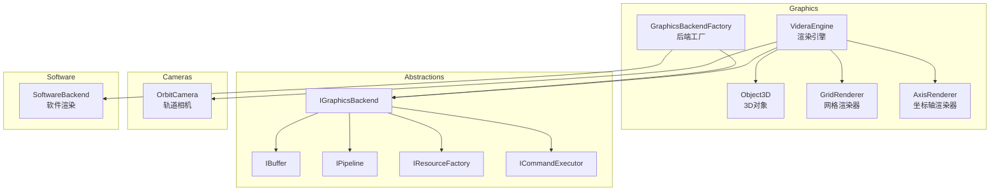
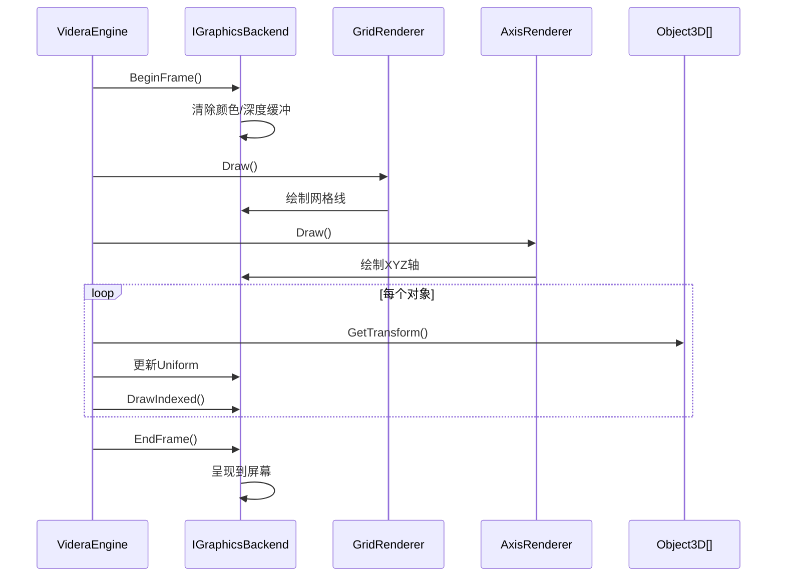
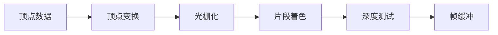

# Videra.Core - 核心渲染模块

平台无关的3D渲染核心，提供抽象接口和通用渲染逻辑。

## 模块架构



## 核心类说明

### VideraEngine

渲染引擎核心，管理场景对象、相机和渲染循环。

```csharp
public class VideraEngine : IDisposable
{
    public OrbitCamera Camera { get; }
    public GridRenderer Grid { get; }
    public AxisRenderer Axis { get; }

    public void Initialize(IGraphicsBackend backend);
    public void AddObject(Object3D obj);
    public void RemoveObject(Object3D obj);
    public void Draw();
}
```

### Object3D

表示场景中的3D对象。

```csharp
public class Object3D
{
    public string Name { get; set; }
    public Matrix4x4 Transform { get; set; }
    public IBuffer? VertexBuffer { get; set; }
    public IBuffer? IndexBuffer { get; set; }
    public PrimitiveTopology Topology { get; set; }
}
```

## 渲染流程



## 抽象接口

### IGraphicsBackend

图形后端抽象接口，各平台需实现此接口。

```csharp
public interface IGraphicsBackend : IDisposable
{
    bool IsInitialized { get; }
    void Initialize(IntPtr windowHandle, int width, int height);
    void Resize(int width, int height);
    void BeginFrame();
    void EndFrame();
    void SetClearColor(Vector4 color);
    IResourceFactory GetResourceFactory();
    ICommandExecutor GetCommandExecutor();
}
```

### IResourceFactory

资源创建工厂接口。

```csharp
public interface IResourceFactory
{
    IBuffer CreateVertexBuffer(VertexPositionNormalColor[] vertices);
    IBuffer CreateIndexBuffer(uint[] indices);
    IBuffer CreateUniformBuffer<T>(T data) where T : unmanaged;
    IPipeline CreatePipeline(IShader vertexShader, IShader fragmentShader);
}
```

## 软件渲染

当硬件加速不可用时，自动回退到CPU软件渲染。



## 文件结构

```
Videra.Core/
├── Cameras/
│   └── OrbitCamera.cs          # 轨道相机
├── Geometry/
│   └── VertexPositionNormalColor.cs  # 顶点结构
├── Graphics/
│   ├── Abstractions/           # 抽象接口
│   │   ├── IBuffer.cs
│   │   ├── ICommandExecutor.cs
│   │   ├── IGraphicsBackend.cs
│   │   ├── IPipeline.cs
│   │   ├── IResourceFactory.cs
│   │   └── ISoftwareBackend.cs
│   ├── Software/               # 软件渲染实现
│   │   ├── SoftwareBackend.cs
│   │   ├── SoftwareBuffer.cs
│   │   └── ...
│   ├── AxisRenderer.cs
│   ├── CameraUniform.cs
│   ├── GraphicsBackendFactory.cs
│   ├── GridRenderer.cs
��   ├── Object3D.cs
│   └── VideraEngine.cs
└── IO/
    └── ModelImporter.cs        # 模型导入
```

## 依赖

- .NET 8.0
- System.Numerics.Vectors
- SharpGLTF.Core (模型导入)
