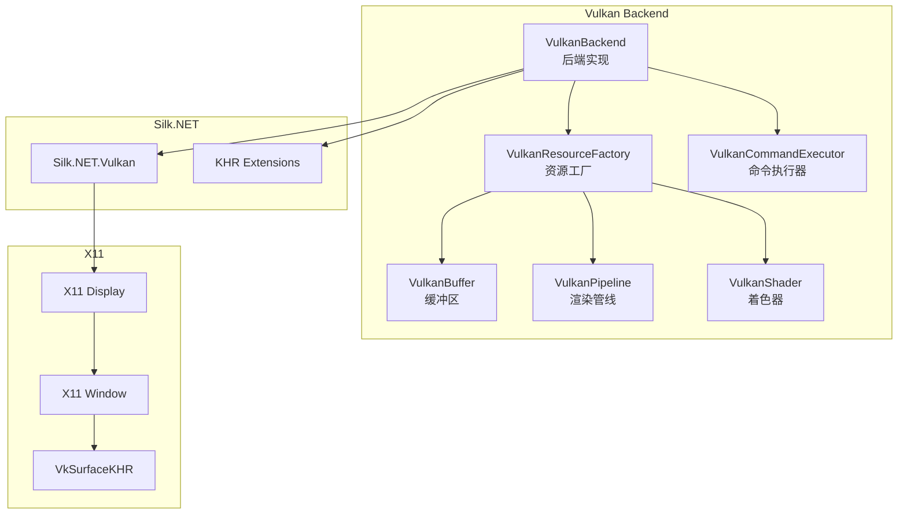
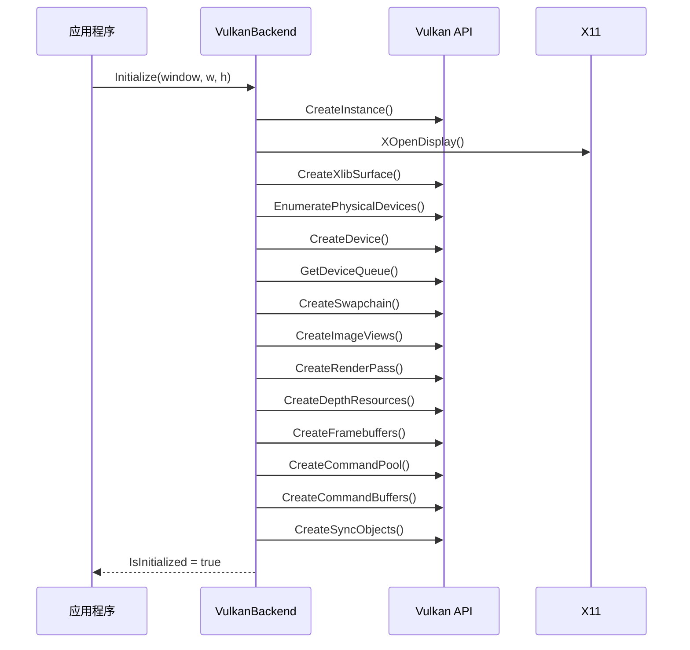
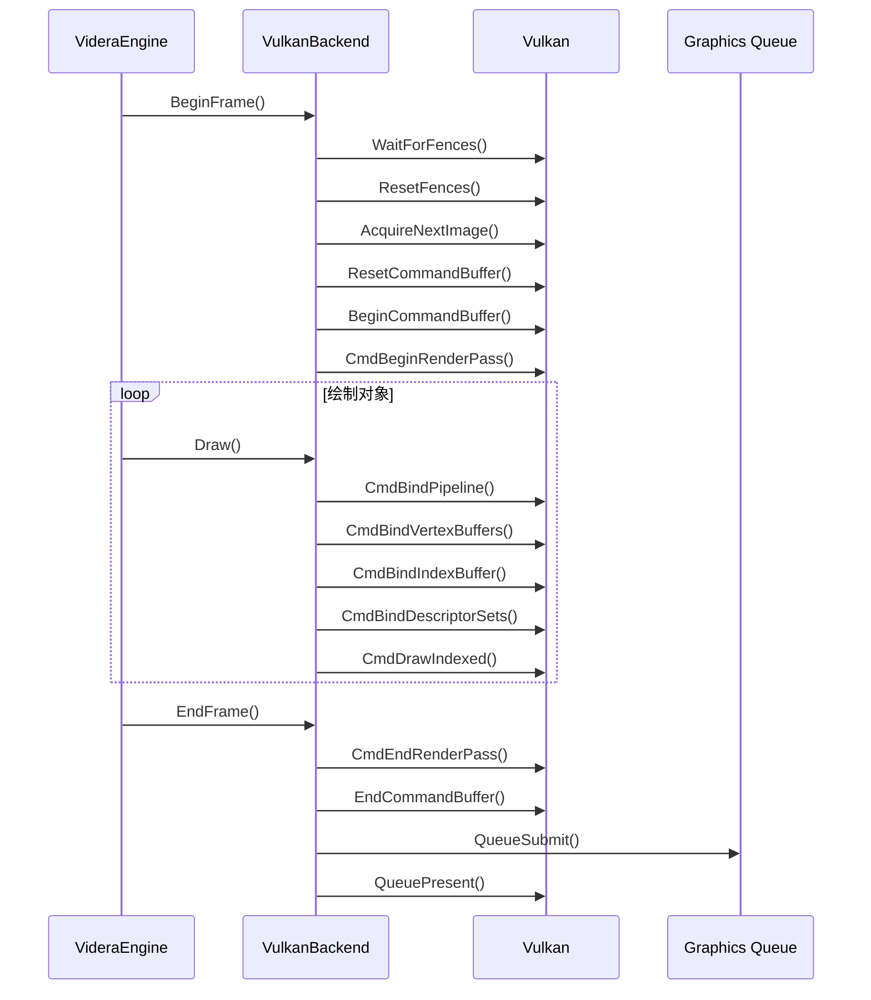
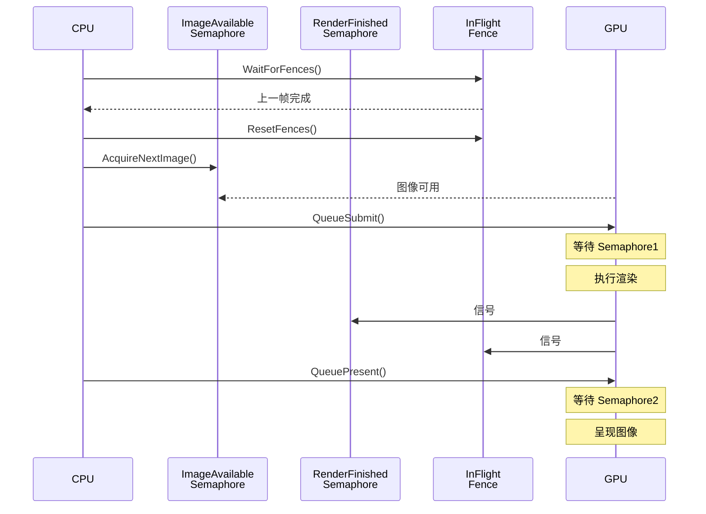

# Videra.Platform.Linux - Vulkan 后端

Linux 平台的 Vulkan 图形后端实现。

## 模块架构



## Vulkan 初始化流程



## 渲染流程



## Vulkan 对象层次

```mermaid
graph TB
    Instance[VkInstance] --> PhysicalDevice[VkPhysicalDevice]
    PhysicalDevice --> Device[VkDevice]
    Device --> Queue[VkQueue]
    Device --> CommandPool[VkCommandPool]
    CommandPool --> CommandBuffer[VkCommandBuffer]
    Device --> Swapchain[VkSwapchainKHR]
    Swapchain --> Images[VkImage[]]
    Images --> ImageViews[VkImageView[]]
    Device --> RenderPass[VkRenderPass]
    ImageViews --> Framebuffers[VkFramebuffer[]]
    RenderPass --> Framebuffers
```

## 同步机制



## 核心类

### VulkanBackend

实现 `IGraphicsBackend` 接口的 Vulkan 后端。

```csharp
public unsafe class VulkanBackend : IGraphicsBackend
{
    public void Initialize(IntPtr windowHandle, int width, int height);
    public void Resize(int width, int height);
    public void BeginFrame();
    public void EndFrame();
    public void SetClearColor(Vector4 color);
    public IResourceFactory GetResourceFactory();
    public ICommandExecutor GetCommandExecutor();
}
```

## 深度缓冲配置

- 深度格式: `VK_FORMAT_D32_SFLOAT`
- 比较函数: `VK_COMPARE_OP_LESS_OR_EQUAL`
- 深度写入: 启用

## 文件结构

```
Videra.Platform.Linux/
├── VulkanBackend.cs           # 后端实现
├── VulkanBuffer.cs            # 缓冲区实现
├── VulkanCommandExecutor.cs   # 命令执行器
├── VulkanPipeline.cs          # 渲染管线
├── VulkanResourceFactory.cs   # 资源工厂
└── VulkanShader.cs            # 着色器
```

## 依赖

- .NET 8.0
- Silk.NET.Vulkan
- Silk.NET.Vulkan.Extensions.KHR
- Silk.NET.Shaderc
- Videra.Core

## 系统要求

- Linux (X11 窗口系统)
- Vulkan 1.2+ 兼容显卡
- libX11.so.6
- Vulkan 驱动程序
